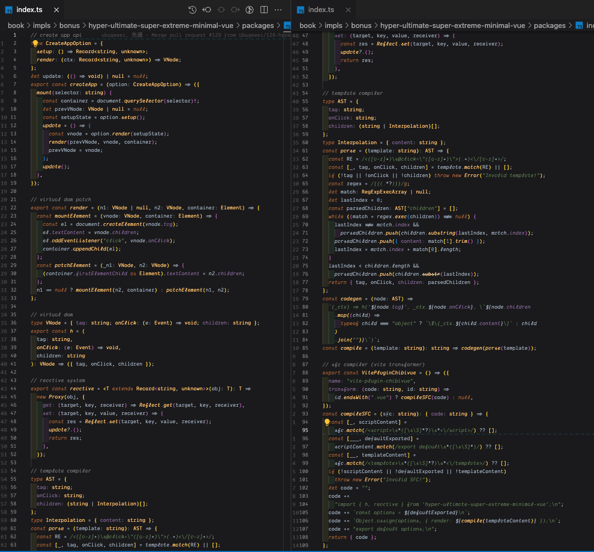

<p align="center">
  
</p>

<div align="center">

### [**Writing Vue.js: Step by Step, from just one line of "Hello, World".**](https://book.chibivue.land)

https://book.chibivue.land

</div>

---

chibivue is minimal [vuejs/core](https://github.com/vuejs/core) implementations.  
(Reactivity System, Virtual DOM and Patch Rendering, Component System, Template Compiler, SFC Compiler)

"`chibi`" means "`small`" in Japanese.

This project began in February 2023 with the goal of simplifying the understanding of Vue's core implementation.

Currently, I am still in the process of implementation, but after implementation, I intend to post explanatory articles as well.

(For now, I plan to post Japanese first.)

[example](https://github.com/chibivue-land/chibivue/tree/main/example/app)

# 👜 Package Manager

This project uses [pnpm](https://pnpm.io/) as a package manager.

And use [ni](https://github.com/antfu/ni) .

```sh
# if you don't have ni yet
npm i -g @antfu/ni
```

# 📔 Online Book

[](https://github.com/chibivue-land/chibivue/actions/workflows/deploy.yml)

> total: 370,000 chars ↑ (japanese)

### book url (GitHub Pages)

English: https://book.chibivue.land/

Japaneses: https://book.chibivue.land/ja

### open book on localhost

```sh
$ git clone https://github.com/chibivue-land/chibivue
$ cd chibivue
$ ni
$ nr book:dev
```

### view on github

[English](https://github.com/chibivue-land/chibivue/tree/main/book/online-book/src) | [Japanese](https://github.com/chibivue-land/chibivue/tree/main/book/online-book/src/ja)
<br/>
<br/>

# 🎥 playground

```sh
$ git clone https://github.com/chibivue-land/chibivue
$ cd chibivue
$ ni

# generate playground files to ~/example/playground (git ignored)
$ nr setup:dev

# listen localhost
$ nr dev
```

# ⚠️ status

This online book is currently a work in progress.

Please refer to the information below for the progress status.

### Reactivity System

| feature         | impl | book |
| --------------- | ---- | ---- |
| ref             | ✅   | ✅   |
| computed        | ✅   | ✅   |
| reactive        | ✅   | ✅   |
| readonly        | ✅   | ✅   |
| watch           | ✅   | ✅   |
| watchEffect     | ✅   | ✅   |
| isRef           | ✅   | ✅   |
| unref           | ✅   | ✅   |
| toRef           | ✅   | ✅   |
| toRefs          | ✅   | ✅   |
| isProxy         | ✅   | ✅   |
| isReactive      | ✅   | ✅   |
| isReadonly      | ✅   | ✅   |
| shallowRef      | ✅   | ✅   |
| triggerRef      | ✅   | ✅   |
| shallowReactive | ✅   | ✅   |
| customRef       | ✅   | ✅   |
| toRaw           | ✅   | ✅   |
| effectScope     | ✅   | ✅   |
| getCurrentScope | ✅   | ✅   |
| onScopeDispose  | ✅   | ✅   |
| template refs   | ✅   | ✅   |

### Virtual Dom & Renderer

| feature         | impl | book |
| --------------- | ---- | ---- |
| h function      | ✅   | ✅   |
| patch rendering | ✅   | ✅   |
| key attribute   | ✅   | ✅   |
| scheduler       | ✅   | ✅   |
| nextTick        | ✅   | ✅   |
| ssr             |      |      |

### Component System

| feature                      | impl | book |
| ---------------------------- | ---- | ---- |
| Options API (typed)          | ✅   | ✅   |
| Composition API              | ✅   | ✅   |
| lifecycle hooks              | ✅   | ✅   |
| props / emit                 | ✅   | ✅   |
| expose                       | ✅   | ✅   |
| provide / inject             | ✅   | ✅   |
| slot (default)               | ✅   | ✅   |
| slot (named/scoped)          | ✅   | ✅   |
| async component and suspense |      |      |

### Template Compiler

| feature            | impl | book |
| ------------------ | ---- | ---- |
| v-bind             | ✅   | ✅   |
| v-on               | ✅   | ✅   |
| event modifier     | ✅   | ✅   |
| v-if               | ✅   | ✅   |
| v-for              | ✅   | ✅   |
| v-model            | ✅   |      |
| v-show             |      |      |
| mustache           | ✅   | ✅   |
| slot (default)     |      |      |
| slot (named)       |      |      |
| slot (scoped)      |      |      |
| dynamic component  |      |      |
| comment out        | ✅   | ✅   |
| fragment           | ✅   | ✅   |
| bind expressions   | ✅   | ✅   |
| resolve components | ✅   | ✅   |

### SFC Compiler

| feature                          | impl | book |
| -------------------------------- | ---- | ---- |
| basics (template, script, style) | ✅   | ✅   |
| scoped css                       |      |      |
| script setup                     | ✅   |      |
| compiler macro                   | ✅   |      |

### Extensions and Other Builtin

| feature    | impl | book |
| ---------- | ---- | ---- |
| store      | ✅   |      |
| router     | ✅   |      |
| keep-alive |      |      |
| suspense   |      |      |

# 🗓️ Big Plans

- Complete Basic Template Compiler
  - Slots
- Complete Basic SFC Compiler
  - script setup
  - compiler macro
- Overall restructuring
  - Fixing typos and errors
  - Reviewing English version of the text
  - Making explanations more understandable
- Implementation and explanation of SSR / SSG
- Implementation and explanation of compile-time optimization  
  Tree flattening and static hoisting, among others
- Incorporate refactoring of the parser that will likely be included in Vue.js 3.4  
　https://github.com/vuejs/core/pull/9674
- Incorporate refactoring of the reactivity package that will likely be included in Vue.js 3.4  
  https://github.com/vuejs/core/pull/5912
- 🌟 Implementation and explanation of \***\*Vapor Mode\*\***  
  Since the official version has not been released, we will implement it based on our predictions.  
  https://github.com/vuejs/core-vapor/tree/main

# 🎉 Bonus Track

This is bonus track on writing Vue.js in 15 minutes because chibivue has gotten so big.

This chapter implements createApp / virtual dom / patch / reactivity / template compiler / sfc compiler in just 110 lines of source code.

The title is "**Hyper Ultimate Super Extreme Minimal Vue - writing Vue.js on 15 minutes**"

[Online Book](https://book.chibivue.land/bonus/hyper-ultimate-super-extreme-minimal-vue) | [Actual Source](https://github.com/chibivue-land/chibivue/blob/main/book/impls/bonus/hyper-ultimate-super-extreme-minimal-vue/packages/index.ts)



# Contributing

Please see [contributing.md](https://github.com/chibivue-land/chibivue/blob/main/.github/contributing.md).


<div align="center">

# Sponsors

<a href="https://github.com/sponsors/ubugeeei">
  
</a>

If you'd like to support my work, I would greatly appreciate it!

https://github.com/sponsors/ubugeeei

</div>

</div>