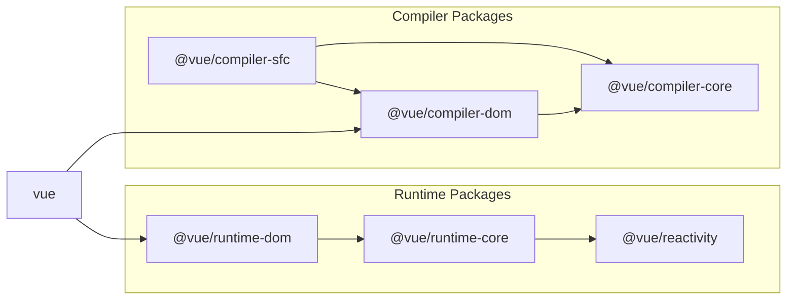

# Vue.js を構成する主要な要素

## Vue.js のリポジトリ

Vue.js はこのリポジトリにあります。  
https://github.com/vuejs/core

実はこれは 3.x 系のリポジトリで、2.x 以前はまた別のリポジトリにあります。  
https://github.com/vuejs/vue

前提として、今回は core リポジトリ(3.x 系)を使って説明していきます。

## Vue.js を構成する主要な要素

さて、まずは Vue.js の実装の全体像から把握してみましょう。
Vue.js のリポジトリにコントリビュートに関するマークダウンファイルがあるので、余力がある方はそこをみてみると構成についても色々書いてます。(まあみなくてもいいです)

https://github.com/vuejs/core/blob/main/.github/contributing.md

ざっくり説明すると、Vue.js は以下のような主要な要素があります。

## runtime

ランタイムとは実際の動作に影響する部分全般です。レンダリングであったり、コンポーネントのステート管理であったり。  
Vue.js で開発した Web アプリケーションのうち、ブラウザ上やサーバー上(SSR の場合)で動作している部分全般のことです。  
具体的には以下の要素を含んでます。(それぞれの詳しい説明は各チャプターでやるのでざっくり)

### Reactivity System

「リアクティビティ」は日本語で言うと「反応性」です。
コンポーネントでもつステートを追跡し、変更があった場合に画面の更新をしたりします。
この、追跡して反応して何かを行うことを反応性と呼んでいます。

```ts
import { ref } from "vue";

const count = ref(0);

// この関数が実行されるとcountを表示していた画面も更新される
const increment = () => {
  count.value++;
};
```

### Virtual DOM

Virtual DOM (仮想 DOM) もまた、Vue.js の強力なシステムの一つです。
Virtual DOM は JS のランタイム上に DOM を模倣した JavaScript のオブジェクトを定義し、それを現在の DOM と見立て、更新時は現在の Virtual DOM と新しい Virtual DOM とを比較して差分のみを本物の DOM に反映する仕組みです。詳しくは専用のチャプターで詳しく解説します。

### Component

Vue.js はコンポーネント指向なフレームワークです。
それぞれのユーザーの要件に応じて保守性の高いコンポーネントを作ってカプセル化・再利用を行うことができます。
また、コンポーネント間でのステートの共有(props/emits や provide/inject など)であったり、ライフサイクルフックの提供を行ったりしています。

(よくよく考えると、値を変更しているだけなのにちゃんと画面が更新されているのは不思議ですよね。)

## Compiler

コンパイラとは開発者インタフェースと内部実装の変換を担う部分です。  
ここでいう「開発者インタフェース」とは、「実際に Vue.js を使用して Web アプリケーション開発を行う開発者」と「Vue の内部実装」の境界のことです。  
具体的には、普段皆さんが書いている Vue を使った実装を想像してもらって、それを内部で扱うための方に変換をする機能が Vue.js に存在していると思ってもらえれば大丈夫です。

Vue.js で開発をしていると、明らかに JavaScript の記述ではない部分があると思います。テンプレートのディレクティブであったり、Single File Component であったり。  
これらの記法(文法)は Vue.js が提供しているもので、これを JavaScript のみ記述に変換する機能があるのです。
そしてこの機能はあくまで開発段階で使われるもので Web アプリケーションとして実際の動作にしている部分ではありません。(JavaScript コードにコンパイルする役目のみを果たします。)

このコンパイラも大きく二つのセクションに別れています。

### Template Compiler (compiler core)

名前の通りテンプレート部分のコンパイラです。
具体的には v-if や v-on といったディレクティブの記法や、ユーザーコンポーネントの記述(`<Counter />`みたいなオリジナルのタグとして書くやつ)や slot の機能などです。

### SFC Compiler

名前の通り Single File Component のコンパイラです。
.vue という拡張子のファイルで、コンポーネントの template, script, style を単一のファイルで記述する機能です。
script setup で使用する defineComponent や defineProps などもこのコンパイラが提供しています。(これは後述)

そして、この SFC コンパイラですが、実際には Webpack や Vite などのツールと組み合わされて使用されます。
他のツールのプラグインとしての実装部分ですが、ここは core リポジトリには存在していません。core に存在するのは SFC コンパイラの主要な機能で、プラグインはプラグインで別のリポジトリに実装されています。(参考: [vitejs/vite-plugin-vue](https://github.com/vitejs/vite-plugin-vue))

ちなみに今回の実装では実際に Vite のプラグインを実装して自作 SFC コンパイラを動作させます。

## vuejs/core のディレクトリを覗いてみる

Vue の主要な要素をざっと把握したところで実際のソースコードがどのような感じになっているか見てみましょう(といってもディレクトリだけだけど)
packages というディレクトリにメインのソースコードが詰まっています。

https://github.com/vuejs/core/tree/main/packages

中でも注目したいのは、

- compiler-core
- compiler-dom
- compiler-sfc
- reactivity
- runtime-core
- runtime-dom
- vue

です。
それぞれの依存関係についてはコントリビュートガイドのこの図がとてもわかりやすいです。



https://github.com/vuejs/core/blob/main/.github/contributing.md#package-dependencies

<br/>
この本では一通りこれらについての実装と解説を行います。
