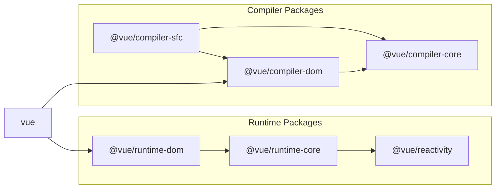

# Key Elements that Constitute Vue.js

## Vue.js Repository

Vue.js can be found in this repository:  
https://github.com/vuejs/core

Interestingly, this is the repository for v3. For v2 and earlier versions, you can find it in another repository:  
https://github.com/vuejs/vue

For the sake of this discussion, we will be focusing on the core repository (v3).

## Main Elements that Make Up Vue.js

Let's first get a holistic understanding of Vue.js's implementation. There is a markdown file about contributions in the Vue.js repository;  
if you're interested, you can check it out to get insights about its architecture. (Though, it's fine if you skip it.)

https://github.com/vuejs/core/blob/main/.github/contributing.md

In broad strokes, Vue.js comprises the following major components:

## Runtime

The runtime encompasses everything that affects the actual operation - from rendering to component state management. This refers to the entirety of a Vue.js-developed web application that operates on a browser or a server (in the case of SSR). Specifically, it includes:

### Component System

Vue.js is a component-oriented framework. Depending on the user's requirements, you can maintainably create and encapsulate components for reuse. It also offers functionalities like state sharing between components (props/emits or provide/inject) and lifecycle hooks.

### Reactivity System

It tracks the state held by components and updates the screen when changes occur. This monitoring and responding mechanism is called reactivity.

```ts
import { ref } from 'vue'

const count = ref(0)

// When this function is executed, the screen displaying the count will also update
const increment = () => {
  count.value++
}
```

(It's fascinating how the screen updates just by changing a value, right?)

### Virtual DOM System

The Virtual DOM system is another one of Vue.js's potent mechanisms. It defines a JavaScript object imitating the DOM on JS's runtime. When updating, it compares the current Virtual DOM to a new one and reflects only the differences to the real DOM. We'll delve deeper into this in a dedicated chapter.

## Compiler

The compiler is responsible for converting the developer interface to the internal implementation. By "developer interface," we mean the boundary between "developers using Vue.js for web application development" and "Vue's internal operations." Essentially, when you write using Vue.js, there are parts that are clearly not pure JavaScript – like template directives or Single File Components. Vue.js provides these syntaxes and converts them to pure JavaScript. This feature is only used during the development stage and isn't part of the actual operational web application (it merely compiles to JavaScript code).

The compiler has two main sections:

### Template Compiler

As the name suggests, this is the compiler for the template part. Specifically, it handles directives like v-if or v-on, user component notations (like <Counter />), and functionalities like slots.

### SFC Compiler

As you might guess, this stands for Single File Component compiler. It allows you to define a component's template, script, and style within a single .vue file. Functions used in script setup like defineComponent or defineProps are also provided by this compiler. And this SFC compiler is often used in conjunction with tools like Webpack or Vite. The implementation as a plugin for other tools doesn't reside in the core repository. The main functionality of the SFC compiler is in the core, but the plugins are implemented in different repositories.
(Reference: [vitejs/vite-plugin-vue](https://github.com/vitejs/vite-plugin-vue))

By the way, we will be implementing an actual Vite plugin to operate our custom SFC compiler.

## Peeking into the vuejs/core Directory

Now that we have a rough understanding of Vue's major elements, let's see how the actual source code looks (although we're just discussing directories). The primary source code is stored in the "packages" directory.

https://github.com/vuejs/core/tree/main/packages

Some of the key directories to focus on are:

- compiler-core
- compiler-dom
- compiler-sfc
- reactivity
- runtime-core
- runtime-dom
- vue

For understanding their interdependencies, the diagram in the contribution guide is particularly insightful.



https://github.com/vuejs/core/blob/main/.github/contributing.md#package-dependencies

<br/>
In this book, we will provide implementation and explanation for all of these topics.
