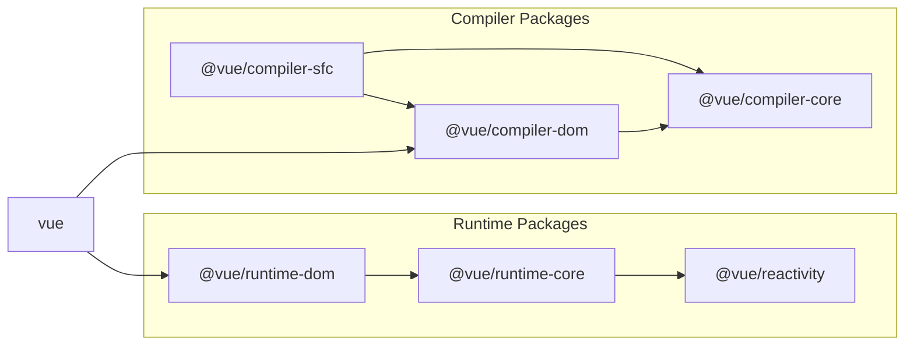

# 小さいテンプレートコンパイラ

## 実はここまでで動作に必要なものは揃った(?)

これまで、 Reactivity System や Virtual DOM 、Component などを実装してきました。  
これらは非常に小さなもので、実用的なものではないのですが、実は動作に必要な構成要素の全体像としては一通り理解できたと言っても過言ではないのです。  
それぞれの要素自体の機能は足りていないですが、浅〜〜〜〜〜く 1 周した感じです。

このチャプターからはより Vue.js に近づけるためにテンプレートの機能を実装するのですが、これらはあくまで DX の改善のためのものであり、ランタイムに影響を出すものではありません。  
もう少し具体的にいうと、DX の向上のために開発者インタフェースを拡張し、「最終的には今まで作った内部実装に変換」します。

## 今回実現したい開発者インタフェース

今現時点ではこのような開発者インタフェースになっています。

```ts
const MyComponent: Component = {
  props: { someMessage: { type: String } },

  setup(props: any, { emit }: any) {
    return () =>
      h('div', {}, [
        h('p', {}, [`someMessage: ${props.someMessage}`]),
        h('button', { onClick: () => emit('click:change-message') }, [
          'change message',
        ]),
      ])
  },
}

const app = createApp({
  setup() {
    const state = reactive({ message: 'hello' })
    const changeMessage = () => {
      state.message += '!'
    }

    return () =>
      h('div', { id: 'my-app' }, [
        h(
          MyComponent,
          {
            'some-message': state.message,
            'onClick:change-message': changeMessage,
          },
          [],
        ),
      ])
  },
})
```

現状だと、View の部分は h 関数を使って構築しています。より生の HTML に近づけるために template オプションに template を描けるようにしたいです。
とは言っても、いきなり色々モリモリで実装するのは大変なので、少し機能を絞って作ってみます。とりあえず、以下のようなタスクに分割してやっていきます。

1. 単純なタグとメッセージ、静的な属性を描画できるように

```ts
const app = createApp({ template: `<p class="hello">Hello World</p>` })
```

2. もう少し複雑な HTML を描画できるように

```ts
const app = createApp({
  template: `
    <div>
      <p>hello</p>
      <button> click me! </button>
    </div>
  `,
})
```

3. setup 関数で定義したものを使えるようにしたい

```ts
const app = createApp({
  setup() {
    const count = ref(0)
    const increment = () => {
      count.value++
    }

    return { count, increment }
  },

  template: `
    <div>
      <p>count: {{ count }}</p>
      <button v-on:click="increment"> click me! </button>
    </div>
  `,
})
```

それぞれでさらに小さく分割はしていくのですが、おおまかにこの 3 ステップに分割してみます。  
まずは 1 からやっていきましょう。

## テンプレートコンパイラの第一歩

さて、今回目指す開発者インタフェースは以下のようなものです。

```ts
const app = createApp({ template: `<p class="hello">Hello World</p>` })
```

ここでまず、コンパイラとはいったいなんなのかという話だけしておきます。  
ソフトウェアを書いているとたちまち「コンパイラ」という言葉を耳にするかと思います。  
「コンパイル」というのは翻訳という意味で、ソフトウェアの領域だとより高級な記述から低級な記述へ変換する際によくこの言葉を使います。
この本の最初の方のこの言葉を覚えているでしょうか?

> ここでは便宜上、生の JS に近ければ近いほど「低級な開発者インタフェース」と呼ぶことにします。  
> そして、ここで重要なのが、「実装を始めるときは低級なところから実装していく」ということです。  
> それはなぜかというと、多くの場合、高級な記述は低級な記述に変換されて動いているからです。  
> つまり、1 も 2 も最終的には内部的に 3 の形に変換しているのです。  
> その変換の実装のことを「コンパイラ (翻訳機)」と呼んでいます。

では、このコンパイラというものがなぜ必要なのかということについてですが、それは「開発体験を向上させる」というのが大きな目的の一つです。  
最低限、動作するような低級なインタフェースが備わっていれば、機能としてはそれらだけで開発を進めることは可能です。  
ですが、記述がわかりづらかったり、機能に関係のない部分を考慮する必要が出てきたりと色々と面倒な問題がでてくるのはしんどいので、利用者の気持ちを考えてインタフェースの部分だけを再開発します。

この点で、Vue.js が目指している点は、「生の HTML のように書けかつ、Vue が提供する機能(ディレクティブなど)を活用して便利に View を書く」と言ったところでしょうか。
そして、そこの行き着く先が SFC といったところでしょうか。
昨今では jsx/tsx の流行もあり、Vue はもちろんこれらも開発者インタフェースの選択肢として提供しています。が、今回は Vue 独自の template を実装する方向でやってみようと思います。

長々と、文章で説明してしまいましたが、結局今回やりたいことは、

このようなコードを、

```ts
const app = createApp({ template: `<p class="hello">Hello World</p>` })
```

このように翻訳(コンパイル)する機能を実装したいです。

```ts
const app = createApp({
  render() {
    return h('p', { class: 'hello' }, ['Hello World'])
  },
})
```

もう少しスコープを狭めるなら、この部分です。

```ts
;`<p class="hello">Hello World</p>`
// ↓
h('p', { class: 'hello' }, ['Hello World'])
```

いくつかのフェーズに分けて、段階的に実装を進めていきましょう。

## 小さいコンパイラを実装してみる。

## 実装アプローチ

基本的なアプローチとしては、template オプションで渡された文字列を操作して特定の関数を生成する感じです。  
コンパイラを３つの要素に分割してみます。

### 解析

解析(parse)は渡された文字列から必要な情報を解析します。以下のようなイメージをしてもらえれば OK です。

```ts
const { tag, props, textContent } = parse(`<p class="hello">Hello World</p>`)
console.log(tag) // "p"
console.log(prop) // { class: "hello" }
console.log(textContent) // "Hello World"
```

### コード生成

コード生成(codegen)では parse の結果をもとにコード(文字列)を生成します。

```ts
const code = codegen({ tag, props, textContent })
console.log(code) // "h('p', { class: 'hello' }, ['Hello World']);"
```

### 関数オブジェクト生成

codegen で生成したコード(文字列)をもとに実際に実行可能な関数を生成します。
JavaScript では、Function コンストラクタを利用することで文字列から関数を生成することが可能です。

```ts
const f = new Function('return 1')
console.log(f()) // 1

// 引数を定義する場合はこんな感じ
const add = new Function('a', 'b', 'return a + b')
console.log(add(1, 1)) // 2
```

これを利用して関数を生成します。
ここで一点注意点があるのですが、生成した関数はその中で定義された変数しか扱うことができないので、h 関数などの読み込みもこれに含んであげます。

```ts
import * as runtimeDom from './runtime-dom'
const render = new Function('ChibiVue', code)(runtimeDom)
```

こうすると、ChibiVue という名前で runtimeDom を受け取ることができるので、codegen の段階で以下のように h 関数を読み込めるようにしておきます。

```ts
const code = codegen({ tag, props, textContent })
console.log(code) // "return () => { const { h } = ChibiVue; return h('p', { class: 'hello' }, ['Hello World']); }"
```

つまり、先ほど、

```ts
;`<p class="hello">Hello World</p>`
// ↓
h('p', { class: 'hello' }, ['Hello World'])
```

のように変換すると言いましたが、正確には、

```ts
;`<p class="hello">Hello World</p>`

// ↓

ChibiVue => {
  return () => {
    const { h } = ChibiVue
    return h('p', { class: 'hello' }, ['Hello World'])
  }
}
```

のように変換し、runtimeDom を渡して render 関数を生成します。
そして、codegen の責務は

```ts
const code = `
  return () => {
      const { h } = ChibiVue;
      return h("p", { class: "hello" }, ["Hello World"]);
  };
`
```

という文字列を生成することです。

## 実装

アプローチが理解できたら早速実装してみましょう。`~/packages/src`に`compiler-core`というディレクトリを作ってそこに`index.ts`, `parse.ts`, `codegen.ts`を作成します。

```sh
pwd # ~/
mkdir packages/compiler-core
touch packages/compiler-core/index.ts
touch packages/compiler-core/parse.ts
touch packages/compiler-core/codegen.ts
```

index.ts は例の如く export するためだけに利用します。

それでは parse から実装していきましょう。
`packages/compiler-core/parse.ts`

```ts
export const baseParse = (
  content: string,
): { tag: string; props: Record<string, string>; textContent: string } => {
  const matched = content.match(/<(\w+)\s+([^>]*)>([^<]*)<\/\1>/)
  if (!matched) return { tag: '', props: {}, textContent: '' }

  const [_, tag, attrs, textContent] = matched

  const props: Record<string, string> = {}
  attrs.replace(/(\w+)=["']([^"']*)["']/g, (_, key: string, value: string) => {
    props[key] = value
    return ''
  })

  return { tag, props, textContent }
}
```

正規表現を使った非常に簡素なパーサではありますが、初めての実装としては十分です。

続いて、コードの生成です。codegen.ts に実装していきます。
`packages/compiler-core/codegen.ts`

```ts
export const generate = ({
  tag,
  props,
  textContent,
}: {
  tag: string
  props: Record<string, string>
  textContent: string
}): string => {
  return `return () => {
  const { h } = ChibiVue;
  return h("${tag}", { ${Object.entries(props)
    .map(([k, v]) => `${k}: "${v}"`)
    .join(', ')} }, ["${textContent}"]);
}`
}
```

それでは、これらを組み合わせて template から関数の文字列を生成する関数を実装します。`packages/compiler-core/compile.ts`というファイルを新たに作成します。
`packages/compiler-core/compile.ts`

```ts
import { generate } from './codegen'
import { baseParse } from './parse'

export function baseCompile(template: string) {
  const parseResult = baseParse(template)
  const code = generate(parseResult)
  return code
}
```

特に難しくないかと思います。実は、compiler-core の責務はここまでです。

## ランタイム上のコンパイラとビルドプロセスのコンパイラ

実は Vue にはコンパイラが 2 種類存在しています。  
それは、ランタイム上(ブラウザ上)で実行されるものと、ビルドプロセス上(Node.js など)で実行されるものです。  
具体的には、ランタイムの方は template オプションまたは html として与えられるテンプレートのコンパイラ、ビルドプロセス上は SFC(や jsx)のコンパイラです。  
template オプションとはちょうど今我々が実装しているものです。

```ts
const app = createApp({ template: `<p class="hello">Hello World</p>` })
app.mount('#app')
```

```html
<div id="app"></div>
```

html として与えられるテンプレートというのは html に Vue の template を書くような開発者インタフェースです。(CDN 経由などでサクッと HTML に盛り込むのに便利です。)

```ts
const app = createApp()
app.mount('#app')
```

```html
<div id="app">
  <p class="hello">Hello World</p>
  <button @click="() => alert('hello')">click me!</button>
</div>
```

これら 2 つはどちらも template をコンパイルする必要がありますが、コンパイルはブラウザ上で実行されます。

一方で、SFC のコンパイルはプロジェクトのビルド時に行われ、ランタイム上にはコンパイル後のコードしか存在していません。(開発環境に vite や webpack 等のバンドラを用意する必要があります。)

```vue
<!-- App.vue -->
<script>
export default {}
</script>

<template>
  <p class="hello">Hello World</p>
  <button @click="() => alert("hello")">click me!</button>
</template>
```

```ts
import App from 'App.vue'
const app = createApp(App)
app.mount('#app')
```

```html
<div id="app"></div>
```

そして、注目するべき点はどっちのコンパイラにせよ、共通の処理という点です。  
この共通部分のソースコードを実装しているのが `compiler-core` ディレクトリです。  
そして、ランタイム上のコンパイラ、SFC コンパイラはそれぞれ`compiler-dom`, `compiler-sfc`というディレクトリに実装されています。  
ぜひ、ここらでこの図を見返してみてください。



https://github.com/vuejs/core/blob/main/.github/contributing.md#package-dependencies

## 実装の続き

少し話が飛んでしまいましたが、実装の続きをやっていきましょう。
先ほどの話を考慮すると、今作っているのはランタイム上で動作するコンパイラなので、`compiler-dom`を作っていくのが良さそうです。

```sh
pwd # ~/
mkdir packages/compiler-dom
touch packages/compiler-dom/index.ts
```

`packages/compiler-dom/index.ts`に実装します。

```ts
import { baseCompile } from '../compiler-core'

export function compile(template: string) {
  return baseCompile(template)
}
```

「えっっっっ、これじゃあただ codegen しただけじゃん。関数の生成はどうするの？」と思ったかも知れません。  
実はここでも関数の生成は行なっておらず、どこで行うかというと`package/index.ts`です。(本家のコードで言うと [packages/vue/src/index.ts](https://github.com/vuejs/core/blob/main/packages/vue/src/index.ts) です)

`package/index.ts`を実装したいところですが、ちょいと下準備があるので先にそちらからやります。
その下準備というのは、`package/runtime-core/component.ts`にコンパイラ本体を保持する変数と、登録用の関数の実装です。

`package/runtime-core/component.ts`

```ts
type CompileFunction = (template: string) => InternalRenderFunction
let compile: CompileFunction | undefined

export function registerRuntimeCompiler(_compile: any) {
  compile = _compile
}
```

それでは、`package/index.ts`で関数の生成をして、登録してあげましょう。

```ts
import { compile } from './compiler-dom'
import { InternalRenderFunction, registerRuntimeCompiler } from './runtime-core'
import * as runtimeDom from './runtime-dom'

function compileToFunction(template: string): InternalRenderFunction {
  const code = compile(template)
  return new Function('ChibiVue', code)(runtimeDom)
}

registerRuntimeCompiler(compileToFunction)

export * from './runtime-core'
export * from './runtime-dom'
export * from './reactivity'
```

※ runtimeDom には h 関数を含める必要があるので `runtime-dom`で export するのを忘れないようにしてください。

```ts
export { h } from '../runtime-core'
```

さて、コンパイラの登録ができたので実際にコンパイルを実行したいです。
コンポーネントのオプションの型に template がなくては始まらないのでとりあえず template は生やしておきます。

```ts
export type ComponentOptions = {
  props?: Record<string, any>
  setup?: (
    props: Record<string, any>,
    ctx: { emit: (event: string, ...args: any[]) => void },
  ) => Function
  render?: Function
  template?: string // 追加
}
```

肝心のコンパイルですが、renderer を少しリファクタする必要があります。

```ts
const mountComponent = (initialVNode: VNode, container: RendererElement) => {
  const instance: ComponentInternalInstance = (initialVNode.component =
    createComponentInstance(initialVNode))

  // ----------------------- ここから
  const { props } = instance.vnode
  initProps(instance, props)
  const component = initialVNode.type as Component
  if (component.setup) {
    instance.render = component.setup(instance.props, {
      emit: instance.emit,
    }) as InternalRenderFunction
  }
  // ----------------------- ここまで

  setupRenderEffect(instance, initialVNode, container)
}
```

`mountComponent`の上記に示した部分を`package/runtime-core/component.ts`に切り出します。

`package/runtime-core/component.ts`

```ts
export const setupComponent = (instance: ComponentInternalInstance) => {
  const { props } = instance.vnode
  initProps(instance, props)

  const component = instance.type as Component
  if (component.setup) {
    instance.render = component.setup(instance.props, {
      emit: instance.emit,
    }) as InternalRenderFunction
  }
}
```

`package/runtime-core/renderer.ts`

```ts
const mountComponent = (initialVNode: VNode, container: RendererElement) => {
  // prettier-ignore
  const instance: ComponentInternalInstance = (initialVNode.component = createComponentInstance(initialVNode));
  setupComponent(instance)
  setupRenderEffect(instance, initialVNode, container)
}
```

それでは、setupComponent 内でコンパイルを実行していきましょう。

```ts
export const setupComponent = (instance: ComponentInternalInstance) => {
  const { props } = instance.vnode
  initProps(instance, props)

  const component = instance.type as Component
  if (component.setup) {
    instance.render = component.setup(instance.props, {
      emit: instance.emit,
    }) as InternalRenderFunction
  }

  // ------------------------ ここ
  if (compile && !component.render) {
    const template = component.template ?? ''
    if (template) {
      instance.render = compile(template)
    }
  }
}
```

これで template オプションで渡した簡素な HTML がコンパイルできるようになったはずなので playground で試してみましょう！

```ts
const app = createApp({ template: `<p class="hello">Hello World</p>` })
app.mount('#app')
```


無事に動いているようです。同じ構造であればコンパイルできるはずなので、少しいじってみて反映されるか確認してみましょう。

```ts
const app = createApp({
  template: `<b class="hello" style="color: red;">Hello World!!</b>`,
})
app.mount('#app')
```


ちゃんと実装できているようです！

ここまでのソースコード:  
[chibivue (GitHub)](https://github.com/Ubugeeei/chibivue/tree/main/book/impls/10_minimum_example/060_template_compiler)
