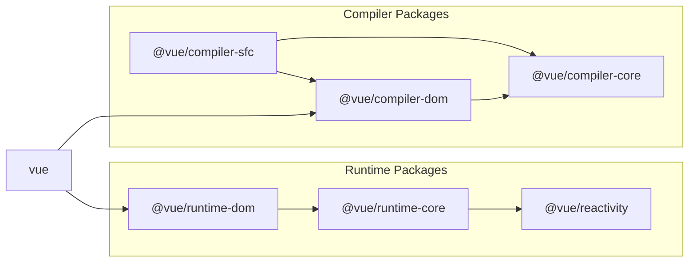

# Single File Component で開発したい

## SFC、どうやって実現している？

## 目標物

ここからはいよいよ SFC(Single File Component)の対応をやっていきます。  
さて、どのように対応していきましょう。SFC はテンプレートと同様、開発時に使われるものでランタイム上には存在しません。  
テンプレートの開発を終えたみなさんにとっては何をどのようにコンパイルすればいいかは簡単な話だと思います。

以下のような SFC を

```vue
<script>
export default {
  setup() {
    const state = reactive({ message: 'Hello, chibivue!' })
    const changeMessage = () => {
      state.message += '!'
    }

    return { state, changeMessage }
  },
}
</script>

<template>
  <div class="container" style="text-align: center">
    <h2>message: {{ state.message }}</h2>
    
    <p><b>chibivue</b> is the minimal Vue.js</p>

    <button @click="changeMessage">click me!</button>
  </div>
</template>

<style>
.container {
  height: 100vh;
  padding: 16px;
  background-color: #becdbe;
  color: #2c3e50;
}
</style>
```

以下のような JS のコードに変換すれば良いのです。

```ts
export default {
  setup() {
    const state = reactive({ message: 'Hello, chibivue!' })
    const changeMessage = () => {
      state.message += '!'
    }

    return { state, changeMessage }
  },

  render(_ctx) {
    return h('div', { class: 'container', style: 'text-align: center' }, [
      h('h2', `message: ${_ctx.state.message}`),
      h('img', {
        width: '150px',
        src: 'https://upload.wikimedia.org/wikipedia/commons/thumb/9/95/Vue.js_Logo_2.svg/1200px-Vue.js_Logo_2.svg.png',
      }),
      h('p', [h('b', 'chibivue'), ' is the minimal Vue.js']),
      h('button', { onClick: _ctx.changeMessage }, 'click me!'),
    ])
  },
}
```

(えっスタイルは!? と思った方もいるかもしれませんが、一旦そのことは忘れて template と script について考えてみましょう。)

## どのタイミングでいつどうやってコンパイルするの？

結論から言ってしまうと、「ビルドツールが依存を解決するときにコンパイラを噛ませる」です。
多くの場合 SFC は他のファイルから import して使います。
この時に、`.vue` というファイルが解決される際にコンパイルをして、結果を App にバインドさせるようなプラグインを書きます。

```ts
import App from './App.vue' // App.vueが読み込まれるときにコンパイル

const app = createApp(App)
app.mount('#app')
```

さまざまなビルドツールがありますが、今回は vite のプラグインを書いてみます。

vite のプラグインを書いたことのない方も少ないと思うので、まずは簡単なサンプルコードでプラグインの実装に慣れてみましょう。
とりあえず簡単な vue のプロジェクトを作ってみます。

```sh
pwd # ~
pnpx create-vite
## ✔ Project name: … plugin-sample
## ✔ Select a framework: › Vue
## ✔ Select a variant: › TypeScript

cd plugin-sample
ni
```

作った PJ の vite.config.ts を見てみましょう。

```ts
import { defineConfig } from 'vite'
import vue from '@vitejs/plugin-vue'

// https://vitejs.dev/config/
export default defineConfig({
  plugins: [vue()],
})
```

何やら@vitejs/plugin-vue を plugin に追加しているのがわかるかと思います。  
実は、vite で vue の PJ を作るとき、SFC が使えているのはこれのおかげなのです。  
このプラグインには SFC のコンパイラが vite のプラグインの API に沿って実装されていて、Vue ファイルを JS ファイルにコンパイルしています。  
このプロジェクトで簡単なプラグインを作ってみましょう。

```ts
import { defineConfig, Plugin } from 'vite'
import vue from '@vitejs/plugin-vue'

// https://vitejs.dev/config/
export default defineConfig({
  plugins: [vue(), myPlugin()],
})

function myPlugin(): Plugin {
  return {
    name: 'vite:my-plugin',

    transform(code, id) {
      if (id.endsWith('.sample.js')) {
        let result = ''

        for (let i = 0; i < 100; i++) {
          result += `console.log("HelloWorld from plugin! (${i})");\n`
        }

        result += code

        return { code: result }
      }
    },
  }
}
```

myPlugin という名前で作ってみました。  
簡単なので説明しなくても読める方も多いと思いますが一応説明しておきます。

プラグインは vite が要求する形式に合わせます。いろんなオプションがありますが、今回は簡単なサンプルなので transform オプションのみを使用しました。  
他は公式ドキュメント等を眺めてもらえるのがいいかと思います。https://vitejs.dev/guide/api-plugin.html

transform では`code`と`id`を受け取ることができます。code はファイルの内容、id はファイル名と思ってもらって良いです。
戻り値として、code というプロパティに成果物を突っ込みます。  
あとは id によってファイルの種類ごとに処理を書いたり、code をいじってファイルの内容を書き換えたりすれば OK です。  
今回は、`*.sample.js`というファイルに対して、ファイルの内容の先頭に console を 100 個数仕込むように書き換えてみました。  
では実際に、適当な plugin.sample.js を実装をして確認してみます。

```sh
pwd # ~/plugin-sample
touch src/plugin.sample.js
```

`~/plugin-sample/src/plugin.sample.js`

```ts
function fizzbuzz(n) {
  for (let i = 1; i <= n; i++) {
    i % 3 === 0 && i % 5 === 0
      ? console.log('fizzbuzz')
      : i % 3 === 0
        ? console.log('fizz')
        : i % 5 === 0
          ? console.log('buzz')
          : console.log(i)
  }
}

fizzbuzz(Math.floor(Math.random() * 100) + 1)
```

`~/plugin-sample/src/main.ts`

```ts
import { createApp } from 'vue'
import './style.css'
import App from './App.vue'
import './plugin.sample.js' // 追加

createApp(App).mount('#app')
```

ブラウザで確認してみましょう。

```sh
pwd # ~/plugin-sample
nr dev
```


ちゃんとソースコードが改変されていることがわかります。

ここまでのソースコード:  
[chibivue (GitHub)](https://github.com/Ubugeeei/chibivue/tree/main/book/impls/10_minimum_example/070_sfc_compiler)

## SFC コンパイラを実装していく

## 準備

先ほど作ったサンプルのプラグインなのですが、もう不要なので消してしまいましょう

```sh
pwd # ~
rm -rf ./plugin-sample
```

plugin の本体なのですが、本来これは vuejs/core の範囲外なので packages に`@extensions`というディレクトリを切ってそこに実装していきます。

```sh
pwd # ~
mkdir -p packages/@extensions/vite-plugin-chibivue
touch packages/@extensions/vite-plugin-chibivue/index.ts
```

`~/packages/@extensions/vite-plugin-chibivue/index.ts`

```ts
import type { Plugin } from 'vite'

export default function vitePluginChibivue(): Plugin {
  return {
    name: 'vite:chibivue',

    transform(code, id) {
      return { code }
    },
  }
}
```

ここから SFC のコンパイラを実装していくのですが、実態がないとイメージが湧きづらいかと思うので playground を実装してみて、動かしながらやっていこうかと思います。  
簡単な SFC とその読み込みを行います。

```sh
pwd # ~
touch examples/playground/src/App.vue
```

`examples/playground/src/App.vue`

```vue
<script>
import { reactive } from 'chibivue'
export default {
  setup() {
    const state = reactive({ message: 'Hello, chibivue!', input: '' })

    const changeMessage = () => {
      state.message += '!'
    }

    const handleInput = e => {
      state.input = e.target?.value ?? ''
    }

    return { state, changeMessage, handleInput }
  },
}
</script>

<template>
  <div class="container" style="text-align: center">
    <h2>{{ state.message }}</h2>
    
    <p><b>chibivue</b> is the minimal Vue.js</p>

    <button @click="changeMessage">click me!</button>

    <br />

    <label>
      Input Data
      <input @input="handleInput" />
    </label>

    <p>input value: {{ state.input }}</p>
  </div>
</template>

<style>
.container {
  height: 100vh;
  padding: 16px;
  background-color: #becdbe;
  color: #2c3e50;
}
</style>
```

`playground/src/main.ts`

```ts
import { createApp } from 'chibivue'
import App from './App.vue'

const app = createApp(App)

app.mount('#app')
```

`playground/vite.config.js`

```ts
import path from 'node:path'
import { fileURLToPath } from 'node:url'
import { defineConfig } from 'vite'

import chibivue from '../../packages/@extensions/vite-plugin-chibivue'

const dirname = path.dirname(fileURLToPath(new URL(import.meta.url)))

export default defineConfig({
  resolve: {
    alias: {
      chibivue: path.resolve(dirname, '../../packages'),
    },
  },
  plugins: [chibivue()],
})
```

この状態で起動してみましょう。


もちろんエラーになります。やったね( ？　)

## エラーの解消

とりあえずエラーを解消していきましょう。いきなり完璧なものは目指しません。  
まず、transform の対象を「\*.vue」に限定してあげましょう。
sample でやったように id で分岐を書いてもいいのですが、せっかく vite から createFilter という関数が提供されているのでそれでフィルターを作ります。(特に理由はないです。)

`~/packages/@extensions/vite-plugin-chibivue/index.ts`

```ts
import type { Plugin } from 'vite'
import { createFilter } from 'vite'

export default function vitePluginChibivue(): Plugin {
  const filter = createFilter(/\.vue$/)

  return {
    name: 'vite:chibivue',

    transform(code, id) {
      if (!filter(id)) return
      return { code: `export default {}` }
    },
  }
}
```

フィルターを作り、vue ファイルだった場合はファイル内容 `export default {}` に transform してみました。  
おそらくエラーは消え、画面は何も表示されない感じになっているかと思います。

## パーサの実装 on compiler-sfc

さて、これではただのその場しのぎなのでちゃんとした実装をしていきます。  
vite-plugin での役割はあくまで vite を利用する際に vite で transform できるようにするためのものなので、パースやコンパイラは vue の本体にあります。  
それが`compiler-sfc`というディレクトリです。



https://github.com/vuejs/core/blob/main/.github/contributing.md#package-dependencies

SFC のコンパイラは vite だろうが webpack だろうがコアな部分は同じです。それらの実装をになっているのが`compiler-sfc`です。

`compiler-sfc`を作っていきましょう。

```sh
pwd # ~
mkdir packages/compiler-sfc
touch packages/compiler-sfc/index.ts
```

SFC のコンパイルでは `SFCDescriptor` というオブジェクトで SFC を表現します。

```sh
touch packages/compiler-sfc/parse.ts
```

`packages/compiler-sfc/parse.ts`

```ts
import { SourceLocation } from '../compiler-core'

export interface SFCDescriptor {
  id: string
  filename: string
  source: string
  template: SFCTemplateBlock | null
  script: SFCScriptBlock | null
  styles: SFCStyleBlock[]
}

export interface SFCBlock {
  type: string
  content: string
  loc: SourceLocation
}

export interface SFCTemplateBlock extends SFCBlock {
  type: 'template'
}

export interface SFCScriptBlock extends SFCBlock {
  type: 'script'
}

export declare interface SFCStyleBlock extends SFCBlock {
  type: 'style'
}
```

まあ、特に難しいことはないです。SFC の情報をオブジェクトで表現しただけです。

`packages/compiler-sfc/parse.ts`では SFC ファイル(文字列)を `SFCDescriptor` にパースします。  
「ええ。あんだけテンプレートのパースを頑張ったのにまたパーサつくるのかよ。。面倒臭い」と思った方もいるかも知れませんが、安心してください。  
ここで実装するパーサは大したものではないです。というのも、これまで作ってきたものを組み合わせて template、script、style を分離するだけなので楽ちんです。

まず、下準備として以前作った template のパーサを export してあげます。

`~/packages/compiler-dom/index.ts`

```ts
import { baseCompile, baseParse } from '../compiler-core'

export function compile(template: string) {
  return baseCompile(template)
}

// パーサをexportしてあげる
export function parse(template: string) {
  return baseParse(template)
}
```

これらの interface を compiler-sfc 側で持っておいてあげます。

```sh
pwd # ~
touch packages/compiler-sfc/compileTemplate.ts
```

`~/packages/compiler-sfc/compileTemplate.ts`

```ts
import { TemplateChildNode } from '../compiler-core'

export interface TemplateCompiler {
  compile(template: string): string
  parse(template: string): { children: TemplateChildNode[] }
}
```

あとはパーサを実装してあげるだけです。

`packages/compiler-sfc/parse.ts`

```ts
import { ElementNode, NodeTypes, SourceLocation } from '../compiler-core'
import * as CompilerDOM from '../compiler-dom'
import { TemplateCompiler } from './compileTemplate'

/**
 * =========
 * 一部省略
 * =========
 */

export interface SFCParseOptions {
  filename?: string
  sourceRoot?: string
  compiler?: TemplateCompiler
}

export interface SFCParseResult {
  descriptor: SFCDescriptor
}

export const DEFAULT_FILENAME = 'anonymous.vue'

export function parse(
  source: string,
  { filename = DEFAULT_FILENAME, compiler = CompilerDOM }: SFCParseOptions = {},
): SFCParseResult {
  const descriptor: SFCDescriptor = {
    id: undefined!,
    filename,
    source,
    template: null,
    script: null,
    styles: [],
  }

  const ast = compiler.parse(source)
  ast.children.forEach(node => {
    if (node.type !== NodeTypes.ELEMENT) return

    switch (node.tag) {
      case 'template': {
        descriptor.template = createBlock(node, source) as SFCTemplateBlock
        break
      }
      case 'script': {
        const scriptBlock = createBlock(node, source) as SFCScriptBlock
        descriptor.script = scriptBlock
        break
      }
      case 'style': {
        descriptor.styles.push(createBlock(node, source) as SFCStyleBlock)
        break
      }
      default: {
        break
      }
    }
  })

  return { descriptor }
}

function createBlock(node: ElementNode, source: string): SFCBlock {
  const type = node.tag

  let { start, end } = node.loc
  start = node.children[0].loc.start
  end = node.children[node.children.length - 1].loc.end
  const content = source.slice(start.offset, end.offset)

  const loc = { source: content, start, end }
  const block: SFCBlock = { type, content, loc }

  return block
}
```

ここまでパーサを実装してきたみなさんにとっては簡単だと思います。  
実際に SFC を plugin 側でパースしてみましょう。

`~/packages/@extensions/vite-plugin-chibivue/index.ts`

```ts
import { parse } from '../../compiler-sfc'

export default function vitePluginChibivue(): Plugin {
  //.
  //.
  //.
  return {
    //.
    //.
    //.
    transform(code, id) {
      if (!filter(id)) return
      const { descriptor } = parse(code, { filename: id })
      console.log(
        '🚀 ~ file: index.ts:14 ~ transform ~ descriptor:',
        descriptor,
      )
      return { code: `export default {}` }
    },
  }
}
```

このコードは vite が動いているプロセス、つまり node で実行されるので console はターミナルに出力されているかと思います。


/_ 途中省略 _/


無事にパースできているようです。やったね！

ここまでのソースコード:  
[chibivue (GitHub)](https://github.com/Ubugeeei/chibivue/tree/main/book/impls/10_minimum_example/070_sfc_compiler2)

## template 部分のコンパイル

`descriptor.script.content` と `descriptor.template.content`にはそれぞれのソースコードが入っています。  
これらを使って上手くコンパイルしたいです。template の方からやっていきましょう。  
テンプレートのコンパイラはすでに持っています。  
しかし、以下のコードを見てもらえればわかるのですが、

```ts
export const generate = ({
  children,
}: {
  children: TemplateChildNode[]
}): string => {
  return `return function render(_ctx) {
  with (_ctx) {
    const { h } = ChibiVue;
    return ${genNode(children[0])};
  }
}`
}
```

これは Function コンストラクタで new する前提の物になってしまっているので先頭に return がついてしまっています。
SFC のコンパイラでは render 関数だけを生成したいので、コンパイラのオプションで分岐できるようにしましょう。
コンパイラの第 2 引数としてオプションを受け取れるようにし、'isBrowser'というフラグを指定可能にします。
この変数が true の時はランタイム上で new される前提のコードを出力し、false の場合は単にコードを生成します。

```sh
pwd # ~
touch packages/compiler-core/options.ts
```

`packages/compiler-core/options.ts`

```ts
export type CompilerOptions = {
  isBrowser?: boolean
}
```

`~/packages/compiler-dom/index.ts`

```ts
export function compile(template: string, option?: CompilerOptions) {
  const defaultOption: Required<CompilerOptions> = { isBrowser: true }
  if (option) Object.assign(defaultOption, option)
  return baseCompile(template, defaultOption)
}
```

`~/packages/compiler-core/compile.ts`

```ts
export function baseCompile(
  template: string,
  option: Required<CompilerOptions>,
) {
  const parseResult = baseParse(template.trim())
  const code = generate(parseResult, option)
  return code
}
```

`~/packages/compiler-core/codegen.ts`

```ts
export const generate = (
  {
    children,
  }: {
    children: TemplateChildNode[]
  },
  option: Required<CompilerOptions>,
): string => {
  return `${option.isBrowser ? 'return ' : ''}function render(_ctx) {
  const { h } = ChibiVue;
  return ${genNode(children[0])};
}`
}
```

ついでに import 文を足しておきました。output という配列にソースコードを詰めていく感じにも変更してます。

```ts
import type { Plugin } from 'vite'
import { createFilter } from 'vite'
import { parse } from '../../compiler-sfc'
import { compile } from '../../compiler-dom'

export default function vitePluginChibivue(): Plugin {
  const filter = createFilter(/\.vue$/)

  return {
    name: 'vite:chibivue',

    transform(code, id) {
      if (!filter(id)) return

      const outputs = []
      outputs.push("import * as ChibiVue from 'chibivue'\n")

      const { descriptor } = parse(code, { filename: id })
      const templateCode = compile(descriptor.template?.content ?? '', {
        isBrowser: false,
      })
      outputs.push(templateCode)

      outputs.push('\n')
      outputs.push(`export default { render }`)

      return { code: outputs.join('\n') }
    },
  }
}
```

これで render 関数をコンパイルできるようになっていると思います。ブラウザの source で確認してみましょう。

と、言いたいところなのですが、実は少し問題があります。

データをテンプレートにバインドする際に、with 文を使用していると思うのですが、Vite は ESM を扱う都合上、非厳格モード (sloppy モード) でのみ動作するコードを処理できず、  
with 文を扱うことができません。  
これまでは vite 上ではなく、単に with 文を含むコード(文字列)を Function コンストラクタに渡してブラウザ上で関数化していたので特に問題にはなっていませんでしたが、
今回はエラーになってしいます。以下のようなエラーが出るはずです。

> Strict mode code may not include a with statement

これについては Vite の公式ドキュメントの方にもトラブルシューティングとして記載されています。

[Syntax Error / Type Error が発生する (Vite)](https://ja.vitejs.dev/guide/troubleshooting.html#syntax-error-type-error-%E3%81%8B%E3%82%99%E7%99%BA%E7%94%9F%E3%81%99%E3%82%8B)

今回は、一時的な対応策として、ブラウザモードでない場合には with 文を含まないコードを生成するようにしてみます。

具体的には、バインド対象のデータに関しては with 文を使用せずに prefix として `_cxt.`　を付与する形で制御してみます。  
一時的な対応なのであまり厳格ではないのですが、概ね動作するようになると思います。  
(ちゃんとした対応は後のチャプターで行います。)

```ts
export const generate = (
  {
    children,
  }: {
    children: TemplateChildNode[]
  },
  option: Required<CompilerOptions>,
): string => {
  // isBrowser が false の場合は with 文を含まないコードを生成する
  return `${option.isBrowser ? 'return ' : ''}function render(_ctx) {
    ${option.isBrowser ? 'with (_ctx) {' : ''}
      const { h } = ChibiVue;
      return ${genNode(children[0], option)};
    ${option.isBrowser ? '}' : ''}
}`
}

// .
// .
// .

const genProp = (
  prop: AttributeNode | DirectiveNode,
  option: Required<CompilerOptions>,
): string => {
  switch (prop.type) {
    case NodeTypes.ATTRIBUTE:
      return `${prop.name}: "${prop.value?.content}"`
    case NodeTypes.DIRECTIVE: {
      switch (prop.name) {
        case 'on':
          return `${toHandlerKey(prop.arg)}: ${
            option.isBrowser ? '' : '_ctx.' // -------------------- ここ
          }${prop.exp}`
        default:
          // TODO: other directives
          throw new Error(`unexpected directive name. got "${prop.name}"`)
      }
    }
    default:
      throw new Error(`unexpected prop type.`)
  }
}

// .
// .
// .

const genInterpolation = (
  node: InterpolationNode,
  option: Required<CompilerOptions>,
): string => {
  return `${option.isBrowser ? '' : '_ctx.'}${node.content}` // ------------ ここ
}
```


上手くコンパイルできているようです。あとは同じ要領で、どうにかして script を引っこ抜いて default exports に突っ込めば OK です。

ここまでのソースコード:  
[chibivue (GitHub)](https://github.com/Ubugeeei/chibivue/tree/main/book/impls/10_minimum_example/070_sfc_compiler3)

## script 部分のコンパイル

さて、元々の SFC の script 部分は以下のようになっています。

```ts
export default {
  setup() {},
}
```

これらを先ほど生成した render 関数といい感じに mix して export したいのですが、どうにか

```ts
{
  setup() {},
}
```

の部分だけ取り出せないでしょうか？

もしこの部分を取り出すことができたら、
以下のようにしてあげれば良いことになります。

```ts
const _sfc_main = {
  setup() {},
}

export default { ..._sfc_main, render }
```

## 外部ライブラリを使う

上記のようなことをしたいのですが結論から言うと以下の 2 つのライブラリを使って楽に実装します。

- @babel/parser
- magic-string

### Babel

https://babeljs.io

[What is Babel](https://babeljs.io/docs)

こちらは普段 JavaScript を使っている方はよく聞くかも知れません。  
Babel は JavaScript の後方互換バージョンに変換するために使用されるツールチェインです。  
簡単に言うと、JS から JS へのコンパイラ(トランスパイラ)です。  
今回は Babel をコンパイラとしてだけではなく、パーサとして利用します。  
Babel はコンパイラとしての役割を持つので、もちろん内部では AST に変換するためのパーサを実装しています。  
そのパーサをライブラリとして利用ます。  
さらっと AST という言葉を出しましたが、JavaScript ももちろん AST としての表現を持っています。  
こちらに AST の仕様があります。(https://github.com/estree/estree)  
上記の GitHub の md ファイルを見てもらっても良いのですが、簡単に JavaScript の AST について説明しておくと、  
まずプログラム全体は Program という AST ノードで表現されていて、Statement を配列で持ちます。(わかりやすいように TS の interface で表現しています。)

```ts
interface Program {
  body: Statement[]
}
```

Statement というのは日本で言うと「文」です。JavaScript は文の集まりです。具体的には「変数宣言文」や「if 文」「for 文」「ブロック」などが挙げられます。

```ts
interface Statement {}

interface VariableDeclaration extends Statement {
  /* 省略 */
}

interface IfStatement extends Statement {
  /* 省略 */
}

interface ForStatement extends Statement {
  /* 省略 */
}

interface BlockStatement extends Statement {
  body: Statement[]
}
// 他にもたくさんある
```

そして、文というのは多くの場合「Expression(式)」を持ちます。式というのは変数に代入できる物だと考えてもらえれば良いです。具体的には「オブジェクト」や「2 項演算」「関数呼び出し」などが挙げられます。

```ts
interface Expression {}

interface BinaryExpression extends Expression {
  operator: '+' | '-' | '*' | '/' // 他にもたくさんあるが省略
  left: Expression
  right: Expression
}

interface ObjectExpression extends Expression {
  properties: Property[] // 省略
}

interface CallExpression extends Expression {
  callee: Expression
  arguments: Expression[]
}

// 他にもたくさんある
```

if 文について考えると、このような構造をとることがわかります。

```ts
interface IfStatement extends Statement {
  test: Expression // 条件値
  consequent: Statement // 条件値がtrueの場合に実行される文
  alternate: Statement | null // 条件値がfalseの場合に実行される文
}
```

このように、JavaScript の構文は上記のような AST にパースされるのです。既に chibivue のテンプレートのコンパイラを実装したみなさんにとっては分かりやすい話だと思います。(同じこと)

なぜ Babel を使うのかというと、理由は２つあって、1 つは単純にめんどくさいからです。パーサを実装したことあるみなさんなら estree を見ながら JS のパーサを実装することも技術的には可能かも知れません。
けど、とてもめんどくさいし、今回の「Vue の理解を深める」という点においてはあまり重要ではありません。もう一つの理由は本家 Vue もこの部分は Babel を使っているという点です。

### magic-string

https://github.com/rich-harris/magic-string

もう一つ使いたいライブラリがあります。こちらも本家の Vue が使っているライブラリです。  
こちらは文字列操作を便利にするライブラリです。

```ts
const input = 'Hello'
const s = new MagicString(input)
```

のようにインスタンスを生成し、そのインスタンスに生えている便利なメソッドを利用して文字列操作をしていきます。
いくつか例をあげます。

```ts
s.append('!!!') // 末尾に追加する
s.prepend('message: ') // 先頭に追加する
s.overwrite(9, 13, 'こんにちは') // 範囲を指定して上書き
```

特に無理して使う必要はないのですが、本家の Vue に合わせて使うことにします。

Babel にしろ magic-string にしろ、実際の使い方等は実装の段階で合わせて説明するのでなんとなくの理解で問題ないです。

## script の default export を書き換える

今一度現在の目標を確認しておくと、

```ts
export default {
  setup() {},
  // その他のオプション
}
```

というコードを、

```ts
const _sfc_main = {
  setup() {},
  // その他のオプション
}

export default { ..._sfc_main, render }
```

というふうに書き換えたいわけです。

つまりは、元々のコードの export 文から良い感じに export 対象をを抜き出し、\_sfc_main という変数に代入できるようになればゴールということです。

まずは必要なライブラリをインストールします。

```sh
pwd # ~
ni @babel/parser magic-string
```

rewriteDefault.ts というファイルを作成します。

```sh
pwd # ~
touch packages/compiler-sfc/rewriteDefault.ts
```

input に対象のソースコード、as に最終的にバインドしたい変数名を受け取れるようにしておきます。  
戻り値として変換されたソースコードを返します。

`~/packages/compiler-sfc/rewriteDefault.ts`

```ts
export function rewriteDefault(input: string, as: string): string {
  // TODO:
  return ''
}
```

まず手始めとして、そもそも export の宣言が存在しない場合のハンドリングをしておきます。
export が存在しないわけなので、からのオブジェクトをバインドして終了です。

```ts
const defaultExportRE = /((?:^|\n|;)\s*)export(\s*)default/
const namedDefaultExportRE = /((?:^|\n|;)\s*)export(.+)(?:as)?(\s*)default/s

export function rewriteDefault(input: string, as: string): string {
  if (!hasDefaultExport(input)) {
    return input + `\nconst ${as} = {}`
  }

  // TODO:
  return ''
}

export function hasDefaultExport(input: string): boolean {
  return defaultExportRE.test(input) || namedDefaultExportRE.test(input)
}
```

ここで Babel パーサと magic-string の登場です。

```ts
import { parse } from '@babel/parser'
import MagicString from 'magic-string'
// .
// .
export function hasDefaultExport(input: string): boolean {
  // .
  // .
  const s = new MagicString(input)
  const ast = parse(input, {
    sourceType: 'module',
  }).program.body
  // .
  // .
}
```

ここからは Babel パーサによって得られた JavaScript の AST(ast) を元に s を文字列操作していきます。
少し長いですが、ソースコード内のコメントで補足の説明も入れていきます。
基本的には AST を手繰っていって、type によって分岐処理を書いて magic-string のメソッドで s を操作していくだけです。

```ts
export function hasDefaultExport(input: string): boolean {
  // .
  // .
  ast.forEach(node => {
    // default exportの場合
    if (node.type === 'ExportDefaultDeclaration') {
      if (node.declaration.type === 'ClassDeclaration') {
        // `export default class Hoge {}` だった場合は、`class Hoge {}` に置き換える
        s.overwrite(node.start!, node.declaration.id.start!, `class `)
        // その上で、`const ${as} = Hoge;` というようなコードを末尾に追加してあげればOK.
        s.append(`\nconst ${as} = ${node.declaration.id.name}`)
      } else {
        // それ以外の default exportは宣言部分を変数宣言に置き換えてあげればOk.
        // eg 1) `export default { setup() {}, }`  ->  `const ${as} = { setup() {}, }`
        // eg 2) `export default Hoge`  ->  `const ${as} = Hoge`
        s.overwrite(node.start!, node.declaration.start!, `const ${as} = `)
      }
    }

    // named export の場合でも宣言中に default exportが発生する場合がある.
    // 主に3パターン
    //   1. `export { default } from "source";`のような宣言の場合
    //   2. `export { hoge as default }` from 'source' のような宣言の場合
    //   3. `export { hoge as default }` のような宣言の場合
    if (node.type === 'ExportNamedDeclaration') {
      for (const specifier of node.specifiers) {
        if (
          specifier.type === 'ExportSpecifier' &&
          specifier.exported.type === 'Identifier' &&
          specifier.exported.name === 'default'
        ) {
          // `from`というキーワードがある場合
          if (node.source) {
            if (specifier.local.name === 'default') {
              // 1. `export { default } from "source";`のような宣言の場合
              // この場合はimport文に抜き出して名前をつけてあげ、最終的な変数にバインドする
              // eg) `export { default } from "source";`  ->  `import { default as __VUE_DEFAULT__ } from 'source'; const ${as} = __VUE_DEFAULT__`
              const end = specifierEnd(input, specifier.local.end!, node.end!)
              s.prepend(
                `import { default as __VUE_DEFAULT__ } from '${node.source.value}'\n`,
              )
              s.overwrite(specifier.start!, end, ``)
              s.append(`\nconst ${as} = __VUE_DEFAULT__`)
              continue
            } else {
              // 2. `export { hoge as default }` from 'source' のような宣言の場合
              // この場合は一度全てのspecifierをそのままimport文に書き換え、as defaultになっている変数を最終的な変数にバインドする
              // eg) `export { hoge as default } from "source";`  ->  `import { hoge } from 'source'; const ${as} = hoge
              const end = specifierEnd(
                input,
                specifier.exported.end!,
                node.end!,
              )
              s.prepend(
                `import { ${input.slice(
                  specifier.local.start!,
                  specifier.local.end!,
                )} } from '${node.source.value}'\n`,
              )

              // 3. `export { hoge as default }`のような宣言の場合
              // この場合は単純に最終的な変数にバインドしてあげる
              s.overwrite(specifier.start!, end, ``)
              s.append(`\nconst ${as} = ${specifier.local.name}`)
              continue
            }
          }
          const end = specifierEnd(input, specifier.end!, node.end!)
          s.overwrite(specifier.start!, end, ``)
          s.append(`\nconst ${as} = ${specifier.local.name}`)
        }
      }
    }
  })
  // .
  // .
}

// 宣言文の終端を算出する
function specifierEnd(input: string, end: number, nodeEnd: number | null) {
  // export { default   , foo } ...
  let hasCommas = false
  let oldEnd = end
  while (end < nodeEnd!) {
    if (/\s/.test(input.charAt(end))) {
      end++
    } else if (input.charAt(end) === ',') {
      end++
      hasCommas = true
      break
    } else if (input.charAt(end) === '}') {
      break
    }
  }
  return hasCommas ? end : oldEnd
}
```

これで default export の書き換えができるようになりました。実際に plugin で使ってみましょう。

```ts
import type { Plugin } from 'vite'
import { createFilter } from 'vite'
import { parse, rewriteDefault } from '../../compiler-sfc'
import { compile } from '../../compiler-dom'

export default function vitePluginChibivue(): Plugin {
  const filter = createFilter(/\.vue$/)

  return {
    name: 'vite:chibivue',

    transform(code, id) {
      if (!filter(id)) return

      const outputs = []
      outputs.push("import * as ChibiVue from 'chibivue'")

      const { descriptor } = parse(code, { filename: id })

      // --------------------------- ここから
      const SFC_MAIN = '_sfc_main'
      const scriptCode = rewriteDefault(
        descriptor.script?.content ?? '',
        SFC_MAIN,
      )
      outputs.push(scriptCode)
      // --------------------------- ここまで

      const templateCode = compile(descriptor.template?.content ?? '', {
        isBrowser: false,
      })
      outputs.push(templateCode)

      outputs.push('\n')
      outputs.push(`export default { ...${SFC_MAIN}, render }`) // ここ

      return { code: outputs.join('\n') }
    },
  }
}
```

その前にちょっとだけ修正します。

`~/packages/runtime-core/component.ts`

```ts
export const setupComponent = (instance: ComponentInternalInstance) => {
  // .
  // .
  // .
  // componentのrenderオプションをインスタンスに
  const { render } = component
  if (render) {
    instance.render = render as InternalRenderFunction
  }
}
```

これでレンダリングができるようになっているはずです!!！


スタイルの対応をしていないのでスタイルが当たっていないですがこれでレンダリングはできるようになりました。

## スタイルブロック

### 仮想モジュール

スタイルも対応してしまいます。vite では css という拡張子のファイルを import することでスタイルを読み込めるようになっています。

```js
import 'app.css'
```

vite の仮想モジュールという機能を使って SFC から仮想的な CSS ファイルを作り、アウトプットの JS ファイルの import 文に追加する方針で実装してみます。  
仮想モジュール、と聞くとなんだか難しいように聞こえますが、「実際には存在しないファイルをあたかも存在するようにインメモリに保持しておける」と捉えてもらえれば問題ないです。  
vite では`load`と`resolve`というオプションを使って仮想モジュールを実現することができます。

```ts
export default function myPlugin() {
  const virtualModuleId = 'virtual:my-module'

  return {
    name: 'my-plugin', // 必須、警告やエラーで表示されます
    resolveId(id) {
      if (id === virtualModuleId) {
        return virtualModuleId
      }
    },
    load(id) {
      if (id === virtualModuleId) {
        return `export const msg = "from virtual module"`
      }
    },
  }
}
```

resolve に解決したいモジュールの id を任意に設定し、load でその id をハンドリングすることによってモジュールを読み込むことができます。  
上記の例だと、`virtual:my-module`というファイルは実際には存在しませんが、

```ts
import { msg } from 'virtual:my-module'
```

のように書くと`export const msg = "from virtual module"`が load されます。

[参考](https://ja.vitejs.dev/guide/api-plugin.html#%E4%BB%AE%E6%83%B3%E3%83%A2%E3%82%B7%E3%82%99%E3%83%A5%E3%83%BC%E3%83%AB%E3%81%AE%E8%A6%8F%E7%B4%84)

子の仕組みを使って SFC の style ブロックを仮想の css ファイルとして読み込むようにしてみます。  
最初に言った通り、vite では css という拡張子のファイルを import すれば良いので、${SFC のファイル名}.css という仮想モジュールを作ることを考えてみます。

### SFC のスタイルブロックの内容で仮想モジュールを実装する

今回は、たとえば「App.vue」というファイルがあったとき、その style 部分を「App.vue.css」という名前の仮想モジュールを実装することを考えてみます。  
やることは単純で、`**.vue.css`という名前のファイルが読み込まれたら`.css`を除いたファイルパス(つまり通常の Vue ファイル)から SFC を`fs.readFileSync`で取得し、  
パースして style タグの内容を取得し、それを code として返します。

```ts
export default function vitePluginChibivue(): Plugin {
  //  ,
  //  ,
  //  ,
  return {
    //  ,
    //  ,
    //  ,
    resolveId(id) {
      // このidは実際には存在しないパスだが、loadで仮想的にハンドリングするのでidを返してあげる (読み込み可能だということにする)
      if (id.match(/\.vue\.css$/)) return id

      // ここでreturnされないidに関しては、実際にそのファイルが存在していたらそのファイルが解決されるし、存在していなければ存在しないというエラーになる
    },
    load(id) {
      // .vue.cssがloadされた (importが宣言され、読み込まれた) ときのハンドリング
      if (id.match(/\.vue\.css$/)) {
        const filename = id.replace(/\.css$/, '')
        const content = fs.readFileSync(filename, 'utf-8') // 普通にSFCファイルを取得
        const { descriptor } = parse(content, { filename }) //  SFCをパース

        // contentをjoinsして結果とする。
        const styles = descriptor.styles.map(it => it.content).join('\n')
        return { code: styles }
      }
    },

    transform(code, id) {
      if (!filter(id)) return

      const outputs = []
      outputs.push("import * as ChibiVue from 'chibivue'")
      outputs.push(`import '${id}.css'`) // ${id}.cssのimport文を宣言しておく
      //  ,
      //  ,
      //  ,
    },
  }
}
```

さて、ブラウザで確認してみましょう。


ちゃんとスタイルが当たるようになっているようです。

ブラウザの方でも、css が import され、.vue.css というファイルが仮想的に生成されているのが分かるかと思います。  
  


これで SFC が使えるようになりました！

ここまでのソースコード:  
[chibivue (GitHub)](https://github.com/Ubugeeei/chibivue/tree/main/book/impls/10_minimum_example/070_sfc_compiler4)
