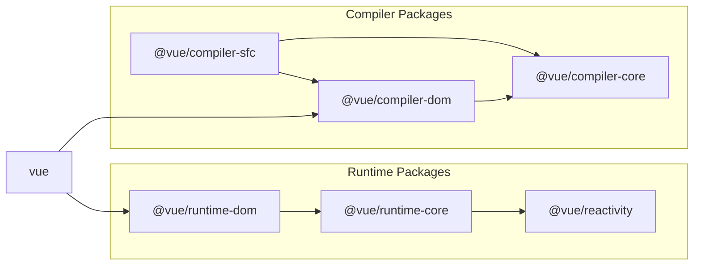

# Small Template Compiler

## Actually, we have everything we need for the operation so far (?)

So far, we have implemented the Reactivity System, Virtual DOM, and Component.
Although these are very small and not practical, it is not an exaggeration to say that we have understood the overall configuration elements necessary for operation.
Although the functionality of each element itself is insufficient, it feels like we have gone through it superficially.

From this chapter, we will implement the template functionality to make it closer to Vue.js. However, these are only for improving DX and do not affect the runtime.
To be more specific, we will extend the developer interface for improving DX and "eventually convert it to the internal implementation we have made so far".

## Developer interface we want to achieve this time

At the moment, the developer interface looks like this.

```ts
const MyComponent: Component = {
  props: { someMessage: { type: String } },

  setup(props: any, { emit }: any) {
    return () =>
      h('div', {}, [
        h('p', {}, [`someMessage: ${props.someMessage}`]),
        h('button', { onClick: () => emit('click:change-message') }, [
          'change message',
        ]),
      ])
  },
}

const app = createApp({
  setup() {
    const state = reactive({ message: 'hello' })
    const changeMessage = () => {
      state.message += '!'
    }

    return () =>
      h('div', { id: 'my-app' }, [
        h(
          MyComponent,
          {
            'some-message': state.message,
            'onClick:change-message': changeMessage,
          },
          [],
        ),
      ])
  },
})
```

Currently, the View part is constructed using the h function. We want to be able to write the template in the template option to make it closer to raw HTML.
However, it is difficult to implement various things all at once, so let's start with a limited set of features. For now, let's divide it into the following tasks:

1. Be able to render simple tags, messages, and static attributes.

```ts
const app = createApp({ template: `<p class="hello">Hello World</p>` })
```

2. Be able to render more complex HTML.

```ts
const app = createApp({
  template: `
    <div>
      <p>hello</p>
      <button> click me! </button>
    </div>
  `,
})
```

3. Be able to use what is defined in the setup function.

```ts
const app = createApp({
  setup() {
    const count = ref(0)
    const increment = () => {
      count.value++
    }

    return { count, increment }
  },

  template: `
    <div>
      <p>count: {{ count }}</p>
      <button v-on:click="increment"> click me! </button>
    </div>
  `,
})
```

We will further divide each of them into smaller parts, but let's roughly divide them into these three steps.
Let's start with step 1.

## First step of the template compiler

Now, the developer interface we are aiming for looks like this.

```ts
const app = createApp({ template: `<p class="hello">Hello World</p>` })
```

First of all, let's talk about what a compiler is.
When writing software, you will soon hear the word "compiler".
"Compile" means translation, and in the field of software, it is often used to mean translating from higher-level descriptions to lower-level descriptions.
Do you remember this word from the beginning of this book?

> For convenience, we will call the closer to raw JS "low-level developer interface".
> And, it is important to note that "when starting implementation, start from the low-level part".
> The reason for this is that in many cases, high-level descriptions are converted to low-level descriptions and run.
> In other words, 1 and 2 are ultimately converted to the form of 3 internally.
> The implementation of this conversion is called a "compiler".

So, why do we need this thing called a compiler? One of the major purposes is to "improve the development experience".
At the very least, if a low-level interface that works is provided, it is possible to develop using only those functions.
However, it can be cumbersome and troublesome to consider various parts that are not related to the functionality, and the description may be difficult to understand. Therefore, we will redevelop only the interface part with the user's feelings in mind.

In this regard, what Vue.js aims for is to "write like raw HTML and use Vue's provided features (directives, etc.) to write views conveniently".
And, the ultimate goal is SFC.
Recently, with the popularity of jsx/tsx, Vue also provides these as options for the developer interface. However, this time, let's try to implement Vue's original template.

I have explained it in a long article, but in the end, what I want to do this time is to implement the ability to translate (compile) code like this:

```ts
const app = createApp({ template: `<p class="hello">Hello World</p>` })
```

into this:

```ts
const app = createApp({
  render() {
    return h('p', { class: 'hello' }, ['Hello World'])
  },
})
```

To narrow down the scope a little more, it is this part:

```ts
;`<p class="hello">Hello World</p>`
// ↓
h('p', { class: 'hello' }, ['Hello World'])
```

Let's implement it step by step in several phases.

## Implementing a Small Compiler

## Implementation Approach

The basic approach is to manipulate the string passed through the template option to generate specific functions. Let's divide the compiler into three elements.

### Parsing

Parsing involves extracting necessary information from the given string. You can think of it like this:

```ts
const { tag, props, textContent } = parse(`<p class="hello">Hello World</p>`)
console.log(tag) // "p"
console.log(prop) // { class: "hello" }
console.log(textContent) // "Hello World"
```

### Code Generation

Code generation generates code (strings) based on the result of parsing.

```ts
const code = codegen({ tag, props, textContent })
console.log(code) // "h('p', { class: 'hello' }, ['Hello World']);"
```

### Function Object Generation

Function object generation creates executable functions based on the code (strings) generated by codegen. In JavaScript, you can generate functions from strings using the Function constructor.

```ts
const f = new Function('return 1')
console.log(f()) // 1

// If you want to define arguments, you can do it like this
const add = new Function('a', 'b', 'return a + b')
console.log(add(1, 1)) // 2
```

We will use this to generate functions. One thing to note here is that the generated function can only handle variables defined within it, so we need to include the import of functions like the h function in it.

```ts
import * as runtimeDom from './runtime-dom'
const render = new Function('ChibiVue', code)(runtimeDom)
```

By doing this, we can receive runtimeDom as ChibiVue and include the h function in the codegen stage as follows:

```ts
const code = codegen({ tag, props, textContent })
console.log(code) // "return () => { const { h } = ChibiVue; return h('p', { class: 'hello' }, ['Hello World']); }"
```

In other words, earlier we said that we would convert it like this:

```ts
;`<p class="hello">Hello World</p>`
// ↓
h('p', { class: 'hello' }, ['Hello World'])
```

But to be precise, we convert it like this:

```ts
;`<p class="hello">Hello World</p>`

// ↓

ChibiVue => {
  return () => {
    const { h } = ChibiVue
    return h('p', { class: 'hello' }, ['Hello World'])
  }
}
```

And pass runtimeDom to generate the render function. The responsibility of codegen is to generate the following string:

```ts
const code = `
  return () => {
      const { h } = ChibiVue;
      return h("p", { class: "hello" }, ["Hello World"]);
  };
`
```

## Implementation

Once you understand the approach, let's implement it. Create a directory called `compiler-core` in `~/packages/src` and create `index.ts`, `parse.ts`, and `codegen.ts` in it.

```sh
pwd # ~/
mkdir packages/compiler-core
touch packages/compiler-core/index.ts
touch packages/compiler-core/parse.ts
touch packages/compiler-core/codegen.ts
```

index.ts is only used for exporting as usual.

Now let's start implementing from parse.
`packages/compiler-core/parse.ts`

```ts
export const baseParse = (
  content: string,
): { tag: string; props: Record<string, string>; textContent: string } => {
  const matched = content.match(/<(\w+)\s+([^>]*)>([^<]*)<\/\1>/)
  if (!matched) return { tag: '', props: {}, textContent: '' }

  const [_, tag, attrs, textContent] = matched

  const props: Record<string, string> = {}
  attrs.replace(/(\w+)=["']([^"']*)["']/g, (_, key: string, value: string) => {
    props[key] = value
    return ''
  })

  return { tag, props, textContent }
}
```

Although it is a very simple parser using regular expressions, it is sufficient for the first implementation.

Next, let's generate the code. Implement it in codegen.ts.
`packages/compiler-core/codegen.ts`

```ts
export const generate = ({
  tag,
  props,
  textContent,
}: {
  tag: string
  props: Record<string, string>
  textContent: string
}): string => {
  return `return () => {
  const { h } = ChibiVue;
  return h("${tag}", { ${Object.entries(props)
    .map(([k, v]) => `${k}: "${v}"`)
    .join(', ')} }, ["${textContent}"]);
}`
}
```

Now, let's implement a function that generates a function string from a template by combining these. Create a new file called `packages/compiler-core/compile.ts`.

`packages/compiler-core/compile.ts`

```ts
import { generate } from './codegen'
import { baseParse } from './parse'

export function baseCompile(template: string) {
  const parseResult = baseParse(template)
  const code = generate(parseResult)
  return code
}
```

This shouldn't be too difficult. In fact, the responsibility of `compiler-core` ends here.

## Runtime Compiler and Build Process Compiler

In fact, Vue has two types of compilers. One is the compiler that runs on the runtime (in the browser), and the other is the compiler that runs in the build process (such as Node.js). Specifically, the runtime compiler is responsible for compiling the template option or the template provided as HTML, while the build process compiler is responsible for compiling SFC (or JSX). The template option we are currently implementing falls into the former category.

```ts
const app = createApp({ template: `<p class="hello">Hello World</p>` })
app.mount('#app')
```

```html
<div id="app"></div>
```

The template provided as HTML is a developer interface where you write Vue templates in HTML. (It is convenient for quickly incorporating it into HTML via CDN, etc.)

```ts
const app = createApp()
app.mount('#app')
```

```html
<div id="app">
  <p class="hello">Hello World</p>
  <button @click="() => alert('hello')">click me!</button>
</div>
```

Both of these need to be compiled, but the compilation is performed in the browser.

On the other hand, SFC compilation is performed during the project build, and only the compiled code exists on the runtime. (You need to set up a bundler such as Vite or webpack in your development environment.)

```vue
<!-- App.vue -->
<script>
export default {}
</script>

<template>
  <p class="hello">Hello World</p>
  <button @click="() => alert("hello")">click me!</button>
</template>
```

```ts
import App from 'App.vue'
const app = createApp(App)
app.mount('#app')
```

```html
<div id="app"></div>
```

The important point to note is that both compilers share common processing. The source code for this common part is implemented in the `compiler-core` directory. And the runtime compiler and SFC compiler are implemented in the `compiler-dom` and `compiler-sfc` directories, respectively. Please take a look at this diagram again.



https://github.com/vuejs/core/blob/main/.github/contributing.md#package-dependencies

## Continued Implementation

We've jumped ahead a bit, but let's continue with the implementation. Although I would like to implement `package/index.ts`, there is some preparation work to be done, so let's do that first. The preparation work is to implement a variable in `package/runtime-core/component.ts` to hold the compiler itself, and a registration function.

`package/runtime-core/component.ts`

```ts
type CompileFunction = (template: string) => InternalRenderFunction
let compile: CompileFunction | undefined

export function registerRuntimeCompiler(_compile: any) {
  compile = _compile
}
```

Now, let's generate the function in `package/index.ts` and register it.

```ts
import { compile } from './compiler-dom'
import { InternalRenderFunction, registerRuntimeCompiler } from './runtime-core'
import * as runtimeDom from './runtime-dom'

function compileToFunction(template: string): InternalRenderFunction {
  const code = compile(template)
  return new Function('ChibiVue', code)(runtimeDom)
}

registerRuntimeCompiler(compileToFunction)

export * from './runtime-core'
export * from './runtime-dom'
export * from './reactivity'
```

※ Don't forget to export the `h` function from `runtime-dom` because it needs to be included in `runtimeDom`.

```ts
export { h } from '../runtime-core'
```

Now that the compiler is registered, let's actually perform the compilation. Since the template is required in the component options type, let's add the template for now.

```ts
export type ComponentOptions = {
  props?: Record<string, any>
  setup?: (
    props: Record<string, any>,
    ctx: { emit: (event: string, ...args: any[]) => void },
  ) => Function
  render?: Function
  template?: string // Added
}
```

Now, let's compile the important part.

```ts
const mountComponent = (initialVNode: VNode, container: RendererElement) => {
  const instance: ComponentInternalInstance = (initialVNode.component =
    createComponentInstance(initialVNode))

  // ----------------------- From here
  const { props } = instance.vnode
  initProps(instance, props)
  const component = initialVNode.type as Component
  if (component.setup) {
    instance.render = component.setup(instance.props, {
      emit: instance.emit,
    }) as InternalRenderFunction
  }
  // ----------------------- To here

  setupRenderEffect(instance, initialVNode, container)
}
```

We will extract the above part in `package/runtime-core/component.ts`.

`package/runtime-core/component.ts`

```ts
export const setupComponent = (instance: ComponentInternalInstance) => {
  const { props } = instance.vnode
  initProps(instance, props)

  const component = instance.type as Component
  if (component.setup) {
    instance.render = component.setup(instance.props, {
      emit: instance.emit,
    }) as InternalRenderFunction
  }
}
```

`package/runtime-core/renderer.ts`

```ts
const mountComponent = (initialVNode: VNode, container: RendererElement) => {
  // prettier-ignore
  const instance: ComponentInternalInstance = (initialVNode.component = createComponentInstance(initialVNode));
  setupComponent(instance)
  setupRenderEffect(instance, initialVNode, container)
}
```

Now, let's perform the compilation inside the `setupComponent` function.

```ts
export const setupComponent = (instance: ComponentInternalInstance) => {
  const { props } = instance.vnode
  initProps(instance, props)

  const component = instance.type as Component
  if (component.setup) {
    instance.render = component.setup(instance.props, {
      emit: instance.emit,
    }) as InternalRenderFunction
  }

  // ------------------------ Here
  if (compile && !component.render) {
    const template = component.template ?? ''
    if (template) {
      instance.render = compile(template)
    }
  }
}
```

Now, we should be able to compile simple HTML using the `template` option. Let's try it in the playground!

```ts
const app = createApp({ template: `<p class="hello">Hello World</p>` })
app.mount('#app')
```


It seems to be working fine. Let's try making some changes to see if they are reflected.

```ts
const app = createApp({
  template: `<b class="hello" style="color: red;">Hello World!!</b>`,
})
app.mount('#app')
```


It appears to be implemented correctly!

Source code up to this point:  
[chibivue (GitHub)](https://github.com/Ubugeeei/chibivue/tree/main/book/impls/10_minimum_example/060_template_compiler)
