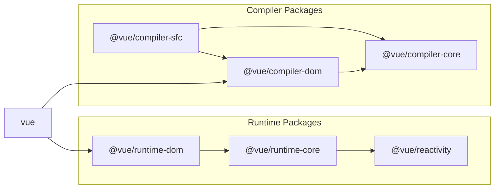

# I want to develop using Single File Component.

## How is SFC implemented?

## Target

Now, let's finally start working on supporting Single File Component (SFC).  
So, how should we go about supporting it? SFC, like templates, is used during development and does not exist in the runtime.  
For those of you who have finished developing the template, I think it's a simple matter of how to compile it.

You just need to convert the following SFC code:

```vue
<script>
export default {
  setup() {
    const state = reactive({ message: 'Hello, chibivue!' })
    const changeMessage = () => {
      state.message += '!'
    }

    return { state, changeMessage }
  },
}
</script>

<template>
  <div class="container" style="text-align: center">
    <h2>message: {{ state.message }}</h2>
    
    <p><b>chibivue</b> is the minimal Vue.js</p>

    <button @click="changeMessage">click me!</button>
  </div>
</template>

<style>
.container {
  height: 100vh;
  padding: 16px;
  background-color: #becdbe;
  color: #2c3e50;
}
</style>
```

into the following JS code:

```ts
export default {
  setup() {
    const state = reactive({ message: 'Hello, chibivue!' })
    const changeMessage = () => {
      state.message += '!'
    }

    return { state, changeMessage }
  },

  render(_ctx) {
    return h('div', { class: 'container', style: 'text-align: center' }, [
      h('h2', `message: ${_ctx.state.message}`),
      h('img', {
        width: '150px',
        src: 'https://upload.wikimedia.org/wikipedia/commons/thumb/9/95/Vue.js_Logo_2.svg/1200px-Vue.js_Logo_2.svg.png',
      }),
      h('p', [h('b', 'chibivue'), ' is the minimal Vue.js']),
      h('button', { onClick: _ctx.changeMessage }, 'click me!'),
    ])
  },
}
```

(You may be wondering about the styles! But for now, let's forget about that and focus on the template and script.)

## When and how should we compile?

In conclusion, "we compile when the build tool resolves the dependencies".
In most cases, SFC is imported and used from other files.
At this time, we write a plugin that compiles the `.vue` file when it is resolved and binds the result to the App.

```ts
import App from './App.vue' // Compile when App.vue is imported

const app = createApp(App)
app.mount('#app')
```

There are various build tools, but this time let's try writing a plugin for Vite.

Since there may be few people who have never written a Vite plugin, let's start by getting familiar with plugin implementation using a simple sample code. Let's create a simple Vue project for now.

```sh
pwd # ~
nlx create-vite
## ✔ Project name: … plugin-sample
## ✔ Select a framework: › Vue
## ✔ Select a variant: › TypeScript

cd plugin-sample
ni
```

Let's take a look at the vite.config.ts file of the created project.

```ts
import { defineConfig } from 'vite'
import vue from '@vitejs/plugin-vue'

// https://vitejs.dev/config/
export default defineConfig({
  plugins: [vue()],
})
```

You can see that it adds `@vitejs/plugin-vue` to the plugins.
Actually, when creating a Vue project with Vite, SFC can be used thanks to this plugin.
This plugin implements the SFC compiler according to the Vite plugin API, and compiles Vue files into JS files.
Let's try creating a simple plugin in this project.

```ts
import { defineConfig, Plugin } from 'vite'
import vue from '@vitejs/plugin-vue'

// https://vitejs.dev/config/
export default defineConfig({
  plugins: [vue(), myPlugin()],
})

function myPlugin(): Plugin {
  return {
    name: 'vite:my-plugin',

    transform(code, id) {
      if (id.endsWith('.sample.js')) {
        let result = ''

        for (let i = 0; i < 100; i++) {
          result += `console.log("HelloWorld from plugin! (${i})");\n`
        }

        result += code

        return { code: result }
      }
    },
  }
}
```

I created it with the name `myPlugin`.
Since it's simple, I think many of you can understand it without explanation, but I'll explain it just in case.

The plugin conforms to the format required by Vite. There are various options, but since this is a simple sample, I only used the `transform` option.
I recommend checking the official documentation and other resources for more information: https://vitejs.dev/guide/api-plugin.html

In the `transform` function, you can receive `code` and `id`. You can think of `code` as the content of the file and `id` as the file name.
As a return value, you put the result in the `code` property.
You can write different processing for each file type based on the `id`, or modify the `code` to rewrite the content of the file.
In this case, I added 100 console logs to the beginning of the file's content for files ending with `*.sample.js`.
Now, let's implement a sample `plugin.sample.js` and check it.

```sh
pwd # ~/plugin-sample
touch src/plugin.sample.js
```

`~/plugin-sample/src/plugin.sample.js`

```ts
function fizzbuzz(n) {
  for (let i = 1; i <= n; i++) {
    i % 3 === 0 && i % 5 === 0
      ? console.log('fizzbuzz')
      : i % 3 === 0
        ? console.log('fizz')
        : i % 5 === 0
          ? console.log('buzz')
          : console.log(i)
  }
}

fizzbuzz(Math.floor(Math.random() * 100) + 1)
```

`~/plugin-sample/src/main.ts`

```ts
import { createApp } from 'vue'
import './style.css'
import App from './App.vue'
import './plugin.sample.js' // 追加

createApp(App).mount('#app')
```

Let's check it in the browser.

```sh
pwd # ~/plugin-sample
nr dev
```


You can see that the source code has been modified properly.

Source code up to this point:  
[chibivue (GitHub)](https://github.com/Ubugeeei/chibivue/tree/main/book/impls/10_minimum_example/070_sfc_compiler)

## Implementing the SFC Compiler

## Preparation

Although this is a sample plugin that we created earlier, let's delete it because it is no longer needed.

```sh
pwd # ~
rm -rf ./plugin-sample
```

Also, install the main Vite package in order to create a Vite plugin.

```sh
pwd # ~
ni vite
```

This is the main part of the plugin, but since this is originally outside the scope of vuejs/core, we will create a directory called `@extensions` in the `packages` directory and implement it there.

```sh
pwd # ~
mkdir -p packages/@extensions/vite-plugin-chibivue
touch packages/@extensions/vite-plugin-chibivue/index.ts
```

`~/packages/@extensions/vite-plugin-chibivue/index.ts`

```ts
import type { Plugin } from 'vite'

export default function vitePluginChibivue(): Plugin {
  return {
    name: 'vite:chibivue',

    transform(code, id) {
      return { code }
    },
  }
}
```

Now, let's implement the SFC compiler. However, it may be difficult to imagine without any substance, so let's implement a playground and do it while running it.  
We will create a simple SFC and load it.

```sh
pwd # ~
touch examples/playground/src/App.vue
```

`examples/playground/src/App.vue`

```vue
<script>
import { reactive } from 'chibivue'
export default {
  setup() {
    const state = reactive({ message: 'Hello, chibivue!', input: '' })

    const changeMessage = () => {
      state.message += '!'
    }

    const handleInput = e => {
      state.input = e.target?.value ?? ''
    }

    return { state, changeMessage, handleInput }
  },
}
</script>

<template>
  <div class="container" style="text-align: center">
    <h2>{{ state.message }}</h2>
    
    <p><b>chibivue</b> is the minimal Vue.js</p>

    <button @click="changeMessage">click me!</button>

    <br />

    <label>
      Input Data
      <input @input="handleInput" />
    </label>

    <p>input value: {{ state.input }}</p>
  </div>
</template>

<style>
.container {
  height: 100vh;
  padding: 16px;
  background-color: #becdbe;
  color: #2c3e50;
}
</style>
```

`playground/src/main.ts`

```ts
import { createApp } from 'chibivue'
import App from './App.vue'

const app = createApp(App)

app.mount('#app')
```

`playground/vite.config.js`

```ts
import path from 'node:path'
import { fileURLToPath } from 'node:url'
import { defineConfig } from 'vite'

import chibivue from '../../packages/@extensions/vite-plugin-chibivue'

const dirname = path.dirname(fileURLToPath(new URL(import.meta.url)))

export default defineConfig({
  resolve: {
    alias: {
      chibivue: path.resolve(dirname, '../../packages'),
    },
  },
  plugins: [chibivue()],
})
```

Let's try starting in this state.


Of course, it will result in an error. Well done (?).

## Resolving the Error

Let's resolve the error for now. We don't aim for perfection right away.
First, let's limit the target of `transform` to "\*.vue".
We can write a branching statement with `id` as we did in the sample, but since Vite provides a function called `createFilter`, let's create a filter using that. (There is no particular reason for this.)

`~/packages/@extensions/vite-plugin-chibivue/index.ts`

```ts
import type { Plugin } from 'vite'
import { createFilter } from 'vite'

export default function vitePluginChibivue(): Plugin {
  const filter = createFilter(/\.vue$/)

  return {
    name: 'vite:chibivue',

    transform(code, id) {
      if (!filter(id)) return
      return { code: `export default {}` }
    },
  }
}
```

We created a filter and transformed the file content to `export default {}` if it was a Vue file.
The error should disappear and the screen should not display anything.

## Implementation of the Parser on compiler-sfc

Now, this is just a temporary solution, so let's implement a proper solution.
The role of vite-plugin is to enable transformation with Vite, so the parsing and compilation are in the main Vue package.
That is the `compiler-sfc` directory.



https://github.com/vuejs/core/blob/main/.github/contributing.md#package-dependencies

The SFC compiler is the same for both Vite and Webpack. The core implementation is in `compiler-sfc`.

Let's create `compiler-sfc`.

```sh
pwd # ~
mkdir packages/compiler-sfc
touch packages/compiler-sfc/index.ts
```

In SFC compilation, the SFC is represented by an object called `SFCDescriptor`.

```sh
touch packages/compiler-sfc/parse.ts
```

`packages/compiler-sfc/parse.ts`

```ts
import { SourceLocation } from '../compiler-core'

export interface SFCDescriptor {
  id: string
  filename: string
  source: string
  template: SFCTemplateBlock | null
  script: SFCScriptBlock | null
  styles: SFCStyleBlock[]
}

export interface SFCBlock {
  type: string
  content: string
  loc: SourceLocation
}

export interface SFCTemplateBlock extends SFCBlock {
  type: 'template'
}

export interface SFCScriptBlock extends SFCBlock {
  type: 'script'
}

export declare interface SFCStyleBlock extends SFCBlock {
  type: 'style'
}
```

Well, there's nothing particularly difficult. It's just an object that represents the SFC information.

In `packages/compiler-sfc/parse.ts`, we will parse the SFC file (string) into `SFCDescriptor`.
Some of you may be thinking, "What? You worked so hard on the template parser, and now you're creating another parser...? It's a hassle." But don't worry.
The parser we're going to implement here is not a big deal. That's because we're just separating the template, script, and style by combining what we've created so far.

First, as a preparation, export the template parser we created earlier.

`~/packages/compiler-dom/index.ts`

```ts
import { baseCompile, baseParse } from '../compiler-core'

export function compile(template: string) {
  return baseCompile(template)
}

// Export the parser
export function parse(template: string) {
  return baseParse(template)
}
```

Keep these interfaces in the compiler-sfc side.

```sh
pwd # ~
touch packages/compiler-sfc/compileTemplate.ts
```

`~/packages/compiler-sfc/compileTemplate.ts`

```ts
import { TemplateChildNode } from '../compiler-core'

export interface TemplateCompiler {
  compile(template: string): string
  parse(template: string): { children: TemplateChildNode[] }
}
```

Then, just implement the parser.

`packages/compiler-sfc/parse.ts`

```ts
import { ElementNode, NodeTypes, SourceLocation } from '../compiler-core'
import * as CompilerDOM from '../compiler-dom'
import { TemplateCompiler } from './compileTemplate'

export interface SFCParseOptions {
  filename?: string
  sourceRoot?: string
  compiler?: TemplateCompiler
}

export interface SFCParseResult {
  descriptor: SFCDescriptor
}

export const DEFAULT_FILENAME = 'anonymous.vue'

export function parse(
  source: string,
  { filename = DEFAULT_FILENAME, compiler = CompilerDOM }: SFCParseOptions = {},
): SFCParseResult {
  const descriptor: SFCDescriptor = {
    id: undefined!,
    filename,
    source,
    template: null,
    script: null,
    styles: [],
  }

  const ast = compiler.parse(source)
  ast.children.forEach(node => {
    if (node.type !== NodeTypes.ELEMENT) return

    switch (node.tag) {
      case 'template': {
        descriptor.template = createBlock(node, source) as SFCTemplateBlock
        break
      }
      case 'script': {
        const scriptBlock = createBlock(node, source) as SFCScriptBlock
        descriptor.script = scriptBlock
        break
      }
      case 'style': {
        descriptor.styles.push(createBlock(node, source) as SFCStyleBlock)
        break
      }
      default: {
        break
      }
    }
  })

  return { descriptor }
}

function createBlock(node: ElementNode, source: string): SFCBlock {
  const type = node.tag

  let { start, end } = node.loc
  start = node.children[0].loc.start
  end = node.children[node.children.length - 1].loc.end
  const content = source.slice(start.offset, end.offset)

  const loc = { source: content, start, end }
  const block: SFCBlock = { type, content, loc }

  return block
}
```

I think it's easy for everyone who has implemented the parser so far. Let's actually parse SFC in the plugin.

`~/packages/@extensions/vite-plugin-chibivue/index.ts`

```ts
import { parse } from '../../compiler-sfc'

export default function vitePluginChibivue(): Plugin {
  //.
  //.
  //.
  return {
    //.
    //.
    //.
    transform(code, id) {
      if (!filter(id)) return
      const { descriptor } = parse(code, { filename: id })
      console.log(
        '🚀 ~ file: index.ts:14 ~ transform ~ descriptor:',
        descriptor,
      )
      return { code: `export default {}` }
    },
  }
}
```

This code runs in the process where Vite is running, which means it is executed in Node, so I think the console output is displayed in the terminal.


/_ Omitted for brevity _/


It seems that parsing was successful. Great job!

Source code up to this point:  
[chibivue (GitHub)](https://github.com/Ubugeeei/chibivue/tree/main/book/impls/10_minimum_example/070_sfc_compiler2)

## Compiling the template section

`descriptor.script.content` and `descriptor.template.content` contain the source code of each section.  
Let's compile them successfully. Let's start with the template section.  
We already have the template compiler.  
However, as you can see from the following code,

```ts
export const generate = ({
  children,
}: {
  children: TemplateChildNode[]
}): string => {
  return `return function render(_ctx) {
  with (_ctx) {
    const { h } = ChibiVue;
    return ${genNode(children[0])};
  }
}`
}
```

This assumes that it will be used with the Function constructor, so it includes the `return` statement at the beginning.  
In the SFC compiler, we only want to generate the render function, so let's make it possible to branch with compiler options.  
Let's make it possible to receive options as the second argument of the compiler and specify a flag called `isBrowser`.  
When this variable is `true`, it outputs code that assumes it will be `new` on the runtime, and when it is `false`, it simply generates code.

```sh
pwd # ~
touch packages/compiler-core/options.ts
```

`packages/compiler-core/options.ts`

```ts
export type CompilerOptions = {
  isBrowser?: boolean
}
```

`~/packages/compiler-dom/index.ts`

```ts
export function compile(template: string, option?: CompilerOptions) {
  const defaultOption: Required<CompilerOptions> = { isBrowser: true }
  if (option) Object.assign(defaultOption, option)
  return baseCompile(template, defaultOption)
}
```

`~/packages/compiler-core/compile.ts`

```ts
export function baseCompile(
  template: string,
  option: Required<CompilerOptions>,
) {
  const parseResult = baseParse(template.trim())
  const code = generate(parseResult, option)
  return code
}
```

`~/packages/compiler-core/codegen.ts`

```ts
export const generate = (
  {
    children,
  }: {
    children: TemplateChildNode[]
  },
  option: Required<CompilerOptions>,
): string => {
  return `${option.isBrowser ? 'return ' : ''}function render(_ctx) {
  const { h } = ChibiVue;
  return ${genNode(children[0])};
}`
}
```

I also added the import statement. I changed it to add the generated source code to the `output` array.

```ts
import type { Plugin } from 'vite'
import { createFilter } from 'vite'
import { parse } from '../../compiler-sfc'
import { compile } from '../../compiler-dom'

export default function vitePluginChibivue(): Plugin {
  const filter = createFilter(/\.vue$/)

  return {
    name: 'vite:chibivue',

    transform(code, id) {
      if (!filter(id)) return

      const outputs = []
      outputs.push("import * as ChibiVue from 'chibivue'\n")

      const { descriptor } = parse(code, { filename: id })
      const templateCode = compile(descriptor.template?.content ?? '', {
        isBrowser: false,
      })
      outputs.push(templateCode)

      outputs.push('\n')
      outputs.push(`export default { render }`)

      return { code: outputs.join('\n') }
    },
  }
}
```

Now you should be able to compile the render function. Let's check it in the browser's source.

However, there is a small problem.

When binding data to the template, I think you are using the `with` statement. However, due to the nature of Vite handling ESM, it cannot process code that only works in non-strict mode (sloppy mode) and cannot handle `with` statements.  
So far, it hasn't been a problem because I was simply passing code (strings) containing `with` statements to the Function constructor and making it a function in the browser, but now it throws an error. You should see an error like this:

> Strict mode code may not include a with statement

This is also described in the Vite official documentation as a troubleshooting tip.

[Syntax Error / Type Error Occurs (Vite)](https://vitejs.dev/guide/troubleshooting.html#syntax-error-type-error-occurs)

As a temporary solution, let's try to generate code that does not include the `with` statement when it is not in browser mode.

Specifically, for the data to be bound, let's try to control it by adding the prefix `_ctx.` instead of using the `with` statement.  
Since this is a temporary solution, it is not very strict, but I think it will work generally.  
(The proper solution will be implemented in a later chapter.)

```ts
export const generate = (
  {
    children,
  }: {
    children: TemplateChildNode[]
  },
  option: Required<CompilerOptions>,
): string => {
  // Generate code that does not include the `with` statement when `isBrowser` is false
  return `${option.isBrowser ? 'return ' : ''}function render(_ctx) {
    ${option.isBrowser ? 'with (_ctx) {' : ''}
      const { h } = ChibiVue;
      return ${genNode(children[0], option)};
    ${option.isBrowser ? '}' : ''}
}`
}

// .
// .
// .

const genProp = (
  prop: AttributeNode | DirectiveNode,
  option: Required<CompilerOptions>,
): string => {
  switch (prop.type) {
    case NodeTypes.ATTRIBUTE:
      return `${prop.name}: "${prop.value?.content}"`
    case NodeTypes.DIRECTIVE: {
      switch (prop.name) {
        case 'on':
          return `${toHandlerKey(prop.arg)}: ${
            option.isBrowser ? '' : '_ctx.' // -------------------- Here
          }${prop.exp}`
        default:
          // TODO: other directives
          throw new Error(`unexpected directive name. got "${prop.name}"`)
      }
    }
    default:
      throw new Error(`unexpected prop type.`)
  }
}

// .
// .
// .

const genInterpolation = (
  node: InterpolationNode,
  option: Required<CompilerOptions>,
): string => {
  return `${option.isBrowser ? '' : '_ctx.'}${node.content}` // ------------ Here
}
```


It seems that it was compiled successfully. All that's left is to extract the script in the same way and put it into the default exports.

Source code up to this point:  
[chibivue (GitHub)](https://github.com/Ubugeeei/chibivue/tree/main/book/impls/10_minimum_example/070_sfc_compiler3)

## Compiling the script section

Now, the original script section of SFC looks like this:

```ts
export default {
  setup() {},
}
```

I want to extract only the following part:

```ts
{
  setup() {},
}
```

Is there any way to do this?

If I can extract this part, I can mix it nicely with the previously generated render function and export it as follows:

```ts
const _sfc_main = {
  setup() {},
}

export default { ..._sfc_main, render }
```

## Using external libraries

To achieve the above, I will use the following two libraries:

- @babel/parser
- magic-string

### Babel

https://babeljs.io

[What is Babel](https://babeljs.io/docs)

You may have heard of Babel if you are familiar with JavaScript. Babel is a toolchain used to convert JavaScript into backward-compatible versions. In simple terms, it is a compiler (transpiler) from JS to JS. In this case, I will use Babel not only as a compiler but also as a parser. Babel has an internal parser for converting to AST, as it plays the role of a compiler. AST stands for Abstract Syntax Tree, which is a representation of JavaScript code. You can find the AST specification here (https://github.com/estree/estree). Although you can refer to the GitHub md file, I will briefly explain AST in JavaScript. The entire program is represented by a Program AST node, which contains an array of statements (represented using TS interfaces for clarity).

```ts
interface Program {
  body: Statement[]
}
```

Statement represents a "statement" in JavaScript, which is a collection of statements. Examples include "variable declaration statement," "if statement," "for statement," and "block statement."

```ts
interface Statement {}

interface VariableDeclaration extends Statement {
  /* omitted */
}

interface IfStatement extends Statement {
  /* omitted */
}

interface ForStatement extends Statement {
  /* omitted */
}

interface BlockStatement extends Statement {
  body: Statement[]
}
// There are many more
```

Statements usually have an "expression" in most cases. An expression is something that can be assigned to a variable. Examples include "object," "binary operation," and "function call."

```ts
interface Expression {}

interface BinaryExpression extends Expression {
  operator: '+' | '-' | '*' | '/' // There are many more, but omitted
  left: Expression
  right: Expression
}

interface ObjectExpression extends Expression {
  properties: Property[] // omitted
}

interface CallExpression extends Expression {
  callee: Expression
  arguments: Expression[]
}

// There are many more
```

If we consider an if statement, it has the following structure:

```ts
interface IfStatement extends Statement {
  test: Expression // condition
  consequent: Statement // statements to be executed if the condition is true
  alternate: Statement | null // statements to be executed if the condition is false
}
```

In this way, JavaScript syntax is parsed into the AST mentioned above. I think this explanation is easy to understand for those who have already implemented the template compiler for chibivue. (It's the same thing)

The reason why I use Babel is twofold. First, it's simply because it's cumbersome. If you have implemented a parser before, it may be technically possible to implement a JS parser while referring to estree. However, it is very cumbersome, and it is not very important for the purpose of "deepening understanding of Vue" in this case. The other reason is that the official Vue also uses Babel for this part.

### magic-string

https://github.com/rich-harris/magic-string

There is another library I want to use. This library is also used by the official Vue. It is a library that makes string manipulation easier.

```ts
const input = 'Hello'
const s = new MagicString(input)
```

You can generate an instance like this and use the convenient methods provided by the instance to manipulate strings. Here are some examples:

```ts
s.append('!!!') // Append to the end
s.prepend('message: ') // Prepend to the beginning
s.overwrite(9, 13, 'こんにちは') // Overwrite within a range
```

There is no need to use it forcefully, but I will use it to align with the official Vue.

Whether it's Babel or magic-string, you don't need to understand the actual usage at this point. I will explain and align the implementation later, so it's okay to have a rough understanding for now.

## Rewriting the default export of the script

To recap the current goal:

```ts
export default {
  setup() {},
  // Other options
}
```

I want to rewrite the code above to:

```ts
const _sfc_main = {
  setup() {},
  // Other options
}

export default { ..._sfc_main, render }
```

In other words, if I can extract the export target from the original code's export statement and assign it to a variable called `_sfc_main`, I will achieve the goal.

First, let's install the necessary libraries.

```sh
pwd # ~
ni @babel/parser magic-string
```

Create a file called "rewriteDefault.ts".

```sh
pwd # ~
touch packages/compiler-sfc/rewriteDefault.ts
```

Make sure that the function "rewriteDefault" can receive the target source code as "input" and the variable name to be bound as "as".  
Return the converted source code as the return value.

`~/packages/compiler-sfc/rewriteDefault.ts`

```ts
export function rewriteDefault(input: string, as: string): string {
  // TODO:
  return ''
}
```

First, let's handle the case where the export declaration does not exist. Since there is no export, bind an empty object and finish.

```ts
const defaultExportRE = /((?:^|\n|;)\s*)export(\s*)default/
const namedDefaultExportRE = /((?:^|\n|;)\s*)export(.+)(?:as)?(\s*)default/s

export function rewriteDefault(input: string, as: string): string {
  if (!hasDefaultExport(input)) {
    return input + `\nconst ${as} = {}`
  }

  // TODO:
  return ''
}

export function hasDefaultExport(input: string): boolean {
  return defaultExportRE.test(input) || namedDefaultExportRE.test(input)
}
```

Here is the translation of the given Japanese text:

Here comes the Babel parser and magic-string.

```ts
import { parse } from '@babel/parser'
import MagicString from 'magic-string'
// .
// .
export function rewriteDefault(input: string, as: string): string {
  // .
  // .
  const s = new MagicString(input)
  const ast = parse(input, {
    sourceType: 'module',
  }).program.body
  // .
  // .
}
```

From here, we will manipulate the string `s` based on the JavaScript AST (Abstract Syntax Tree) obtained by the Babel parser. Although it is a bit long, I will provide additional explanations in the comments in the source code. Basically, we traverse the AST and write conditional statements based on the `type` property, and manipulate the string `s` using the methods of `magic-string`.

```ts
export function hasDefaultExport(input: string): boolean {
  // .
  // .
  ast.forEach(node => {
    // In case of default export
    if (node.type === 'ExportDefaultDeclaration') {
      if (node.declaration.type === 'ClassDeclaration') {
        // If it is `export default class Hoge {}`, replace it with `class Hoge {}`
        s.overwrite(node.start!, node.declaration.id.start!, `class `)
        // Then, add code like `const ${as} = Hoge;` at the end.
        s.append(`\nconst ${as} = ${node.declaration.id.name}`)
      } else {
        // For other default exports, replace the declaration part with a variable declaration.
        // eg 1) `export default { setup() {}, }`  ->  `const ${as} = { setup() {}, }`
        // eg 2) `export default Hoge`  ->  `const ${as} = Hoge`
        s.overwrite(node.start!, node.declaration.start!, `const ${as} = `)
      }
    }

    // There may be a default export in the declaration even in the case of named export.
    // Mainly 3 patterns
    //   1. In the case of declaration like `export { default } from "source";`
    //   2. In the case of declaration like `export { hoge as default }` from 'source'
    //   3. In the case of declaration like `export { hoge as default }`
    if (node.type === 'ExportNamedDeclaration') {
      for (const specifier of node.specifiers) {
        if (
          specifier.type === 'ExportSpecifier' &&
          specifier.exported.type === 'Identifier' &&
          specifier.exported.name === 'default'
        ) {
          // If there is a keyword `from`
          if (node.source) {
            if (specifier.local.name === 'default') {
              // 1. In the case of declaration like `export { default } from "source";`
              // In this case, extract it into an import statement and give it a name, then bind it to the final variable.
              // eg) `export { default } from "source";`  ->  `import { default as __VUE_DEFAULT__ } from 'source'; const ${as} = __VUE_DEFAULT__`
              const end = specifierEnd(input, specifier.local.end!, node.end!)
              s.prepend(
                `import { default as __VUE_DEFAULT__ } from '${node.source.value}'\n`,
              )
              s.overwrite(specifier.start!, end, ``)
              s.append(`\nconst ${as} = __VUE_DEFAULT__`)
              continue
            } else {
              // 2. In the case of declaration like `export { hoge as default }` from 'source'
              // In this case, rewrite all specifiers as they are in the import statement, and bind the variable that is as default to the final variable.
              // eg) `export { hoge as default } from "source";`  ->  `import { hoge } from 'source'; const ${as} = hoge
              const end = specifierEnd(
                input,
                specifier.exported.end!,
                node.end!,
              )
              s.prepend(
                `import { ${input.slice(
                  specifier.local.start!,
                  specifier.local.end!,
                )} } from '${node.source.value}'\n`,
              )

              // 3. In the case of declaration like `export { hoge as default }`
              // In this case, simply bind it to the final variable.
              s.overwrite(specifier.start!, end, ``)
              s.append(`\nconst ${as} = ${specifier.local.name}`)
              continue
            }
          }
          const end = specifierEnd(input, specifier.end!, node.end!)
          s.overwrite(specifier.start!, end, ``)
          s.append(`\nconst ${as} = ${specifier.local.name}`)
        }
      }
    }
  })
  // .
  // .
}

// Calculate the end of the declaration statement
function specifierEnd(input: string, end: number, nodeEnd: number | null) {
  // export { default   , foo } ...
  let hasCommas = false
  let oldEnd = end
  while (end < nodeEnd!) {
    if (/\s/.test(input.charAt(end))) {
      end++
    } else if (input.charAt(end) === ',') {
      end++
      hasCommas = true
      break
    } else if (input.charAt(end) === '}') {
      break
    }
  }
  return hasCommas ? end : oldEnd
}
```

Now you can rewrite the default export. Let's try using it in a plugin.

```ts
import type { Plugin } from 'vite'
import { createFilter } from 'vite'
import { parse, rewriteDefault } from '../../compiler-sfc'
import { compile } from '../../compiler-dom'

export default function vitePluginChibivue(): Plugin {
  const filter = createFilter(/\.vue$/)

  return {
    name: 'vite:chibivue',

    transform(code, id) {
      if (!filter(id)) return

      const outputs = []
      outputs.push("import * as ChibiVue from 'chibivue'")

      const { descriptor } = parse(code, { filename: id })

      // --------------------------- From here
      const SFC_MAIN = '_sfc_main'
      const scriptCode = rewriteDefault(
        descriptor.script?.content ?? '',
        SFC_MAIN,
      )
      outputs.push(scriptCode)
      // --------------------------- To here

      const templateCode = compile(descriptor.template?.content ?? '', {
        isBrowser: false,
      })
      outputs.push(templateCode)

      outputs.push('\n')
      outputs.push(`export default { ...${SFC_MAIN}, render }`) // Here

      return { code: outputs.join('\n') }
    },
  }
}
```

Before that, let's make a small modification.

`~/packages/runtime-core/component.ts`

```ts
export const setupComponent = (instance: ComponentInternalInstance) => {
  // .
  // .
  // .
  // Add the component's render option to the instance
  const { render } = component
  if (render) {
    instance.render = render as InternalRenderFunction
  }
}
```

Now you should be able to render!!!


The styles are not applied because they are not supported, but now you can render the component.

## Style Blocks

### Virtual Modules

Let's also support styles. In Vite, you can import CSS files by using the `.css` extension.

```js
import 'app.css'
```

We will implement this by using Vite's virtual modules. Virtual modules allow you to keep non-existent files in memory as if they exist. You can use the `load` and `resolve` options to implement virtual modules.

```ts
export default function myPlugin() {
  const virtualModuleId = 'virtual:my-module'

  return {
    name: 'my-plugin', // Required, displayed in warnings and errors
    resolveId(id) {
      if (id === virtualModuleId) {
        return virtualModuleId
      }
    },
    load(id) {
      if (id === virtualModuleId) {
        return `export const msg = "from virtual module"`
      }
    },
  }
}
```

By setting the desired module ID in `resolve` and handling the ID in `load`, you can load the module. In the example above, if you write `import { msg } from "virtual:my-module";`, `export const msg = "from virtual module"` will be loaded.

[Reference](https://vitejs.dev/guide/api-plugin.html#virtual-modules)

Let's use the child mechanism to load the style block of the SFC as a virtual CSS file. For example, when there is a file named "App.vue", we will implement a virtual module named "App.vue.css" for the style part. The process is simple: when a file with the name `**.vue.css` is loaded, we will remove the `.css` extension from the file path (i.e., the normal Vue file) and use `fs.readFileSync` to retrieve the SFC. Then, we will parse it and retrieve the content of the style tag, which will be returned as the code.

```ts
export default function vitePluginChibivue(): Plugin {
  //  ,
  //  ,
  //  ,
  return {
    //  ,
    //  ,
    //  ,
    resolveId(id) {
      // This ID is a non-existent path, but we handle it virtually in load, so we return the ID to indicate that it can be loaded
      if (id.match(/\.vue\.css$/)) return id

      // For IDs that are not returned here, if the file actually exists, the file will be resolved, and if it does not exist, an error will be thrown
    },
    load(id) {
      // Handling when .vue.css is loaded (when import is declared and loaded)
      if (id.match(/\.vue\.css$/)) {
        const filename = id.replace(/\.css$/, '')
        const content = fs.readFileSync(filename, 'utf-8') // Retrieve the SFC file normally
        const { descriptor } = parse(content, { filename }) // Parse the SFC

        // Join the content and return it as the result
        const styles = descriptor.styles.map(it => it.content).join('\n')
        return { code: styles }
      }
    },

    transform(code, id) {
      if (!filter(id)) return

      const outputs = []
      outputs.push("import * as ChibiVue from 'chibivue'")
      outputs.push(`import '${id}.css'`) // Declare the import statement for ${id}.css
      //  ,
      //  ,
      //  ,
    },
  }
}
```

Now, let's check in the browser.


It seems that the styles are applied correctly.

In the browser, you can see that the CSS is imported and a `.vue.css` file is generated virtually.

  


Now you can use SFC!

Source code up to this point:  
[chibivue (GitHub)](https://github.com/Ubugeeei/chibivue/tree/main/book/impls/10_minimum_example/070_sfc_compiler4)
