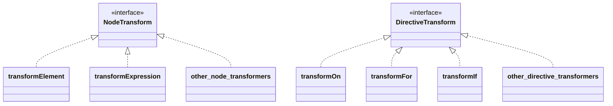

# Implementation of Transformer and Codegen Refactoring (Basic Template Compiler Department Start)

## Review of Existing Implementation

Now, let's implement the template compiler more seriously from where we left off in the Minimum Example department. It has been a while since we worked on it, so let's review the current implementation. The main keywords are Parse, AST, and Codegen.


```ts
export function baseCompile(
  template: string,
  option: Required<CompilerOptions>,
) {
  const ast = baseParse(template.trim())
  const code = generate(ast, option)
  return code
}
```

Actually, this configuration is slightly different from the original one. Let's take a look at the original code.

https://github.com/vuejs/core/blob/37a14a5dae9999bbe684c6de400afc63658ffe90/packages/compiler-core/src/compile.ts#L61

Can you understand it...?

```ts
export function baseCompile(
  template: string,
  option: Required<CompilerOptions>,
) {
  const ast = baseParse(template.trim())
  transform(ast)
  const code = generate(ast, option)
  return code
}
```

It is like this.

This time, we will implement the `transform` function.


## What is Transform?

As you can imagine from the code above, the AST obtained by parsing is transformed in some way by the `transform` function.

You may get an idea by reading this.  
https://github.com/vuejs/core/blob/37a14a5dae9999bbe684c6de400afc63658ffe90/packages/compiler-core/src/ast.ts#L43C1-L51C23

This VNODE_CALL and the AST code with names starting with JS are what we will handle this time.
Vue.js's template compiler is divided into two parts: the AST that represents the result of parsing the template and the AST that represents the generated code.
Our current implementation only handles the former AST.

Let's consider the case where the template `<p>hello</p>` is given as input.

First, the following AST is generated by parsing. This is the same as the existing implementation.

```ts
interface ElementNode {
  tag: string
  props: object /** omitted */
  children: (ElementNode | TextNode | InterpolationNode)[]
}

interface TextNode {
  content: string
}
```

```json
{
  "tag": "p",
  "props": {},
  "children": [{ "content": "hello" }]
}
```

As for the "AST that represents the generated code," let's think about what kind of code should be generated.
I think it would be something like this:

```ts
h('p', {}, ['hello'])
```

This is the AST that represents the generated JavaScript code.
In other words, it is an object that represents the AST for generating the code that should be generated.

```ts
interface VNodeCall {
  tag: string
  props: PropsExpression
  children:
    | TemplateChildNode[] // multiple children
    | TemplateTextChildNode // single text child
    | undefined
}

type PropsExpression = ObjectExpression | CallExpression | ExpressionNode
type TemplateChildNode = ElementNode | InterpolationNode | TextNode
```

```json
{
  "tag": "p",
  "props": {
    "type": "ObjectExpression",
    "properties": []
  },
  "children": { "content": "hello" }
}
```

In this way, the AST that represents the code generated by Codegen is expressed.
You may not feel the need to separate them at this point, but it will be useful when implementing directives in the future.
By separating the AST focused on the input and the AST focused on the output, we can perform the transformation from `input AST -> output AST` using the function called `transform`.

## Codegen Node

Now that we have grasped the flow, let's confirm what kind of Node we will handle (what kind of Node we want to convert). I will explain while enumerating them and providing comments. Please refer to the source code for accurate information as some parts are omitted.

```ts
export interface SimpleExpressionNode extends Node {
  type: NodeTypes.SIMPLE_EXPRESSION
  content: string
  isStatic: boolean
  identifiers?: string[]
}

// This represents an expression that calls the h function.
// It assumes something like `h("p", { class: 'message'}, ["hello"])`.
export interface VNodeCall extends Node {
  type: NodeTypes.VNODE_CALL
  tag: string | symbol
  props: ObjectExpression | undefined // NOTE: It is implemented as PropsExpression in the source code (for future extensions)
  children:
    | TemplateChildNode[] // multiple children
    | TemplateTextChildNode
    | undefined
}

export type JSChildNode =
  | VNodeCall
  | ObjectExpression
  | ArrayExpression
  | ExpressionNode

// This represents a JavaScript Object. It is used for the props of VNodeCall, etc.
export interface ObjectExpression extends Node {
  type: NodeTypes.JS_OBJECT_EXPRESSION
  properties: Array<Property>
}
export interface Property extends Node {
  type: NodeTypes.JS_PROPERTY
  key: ExpressionNode
  value: JSChildNode
}

// This represents a JavaScript Array. It is used for the children of VNodeCall, etc.
export interface ArrayExpression extends Node {
  type: NodeTypes.JS_ARRAY_EXPRESSION
  elements: Array<string | Node>
}
```

## Transformer Design

Before implementing the transformer, let's talk about the design. First, it is important to note that there are two types of transformers: NodeTransform and DirectiveTransform. These are used for transforming nodes and directives, respectively, and take the following interfaces.

```ts
export type NodeTransform = (
  node: RootNode | TemplateChildNode,
  context: TransformContext,
) => void | (() => void) | (() => void)[]

// TODO:
// export type DirectiveTransform = (
//   dir: DirectiveNode,
//   node: ElementNode,
//   context: TransformContext,
// ) => DirectiveTransformResult;
export type DirectiveTransform = Function
```

The DirectiveTransform will be covered later in the chapter when implementing directives, so for now let's call it Function.
Both NodeTransform and DirectiveTransform are actually functions. You can think of them as functions for transforming AST.
Please note that the result of NodeTransform is a function. When implementing transform, if you implement it to return a function, that function will be executed after the transformation of that node (it is called the onExit process).
Any processing you want to perform after the transform of the Node should be described here. I will explain this along with the description of the function called traverseNode later.
The explanation of the interface is mainly as described above.

And as a more specific implementation, there are transformElement for transforming Element and transformExpression for transforming expressions, etc.
As for the implementation of DirectiveTransform, there are implementations for each directive.
These implementations are implemented in compiler-core/src/transforms. The specific transformation processes are implemented here.

https://github.com/vuejs/core/tree/37a14a5dae9999bbe684c6de400afc63658ffe90/packages/compiler-core/src/transforms

image ↓



Next, about the context, TransformContext holds the information and functions used during these transforms.
More will be added in the future, but for now, this is enough.

```ts
export interface TransformContext extends Required<TransformOptions> {
  currentNode: RootNode | TemplateChildNode | null
  parent: ParentNode | null
  childIndex: number
}
```

## Implementation of Transformer

Now let's take a look at the transform function in practice. First, let's start with a general explanation of the framework that is independent of the content of each transformation process.

The structure is very simple, just generate the context and traverse the node using the traverseNode function.
This traverseNode function is the main implementation of the transformation.

```ts
export function transform(root: RootNode, options: TransformOptions) {
  const context = createTransformContext(root, options)
  traverseNode(root, context)
}
```

In traverseNode, basically, it just applies the nodeTransforms (a collection of functions to transform Node) saved in the context to the node.
For those with child nodes, the child nodes are also passed through traverseNode.
The implementation of onExit, which was mentioned during the explanation of the interface, is also here.

```ts
export function traverseNode(
  node: RootNode | TemplateChildNode,
  context: TransformContext,
) {
  context.currentNode = node

  const { nodeTransforms } = context
  const exitFns = [] // Operations to be performed after transformation
  for (let i = 0; i < nodeTransforms.length; i++) {
    const onExit = nodeTransforms[i](node, context)

    // Register operations to be performed after transformation
    if (onExit) {
      if (isArray(onExit)) {
        exitFns.push(...onExit)
      } else {
        exitFns.push(onExit)
      }
    }
    if (!context.currentNode) {
      return
    } else {
      node = context.currentNode
    }
  }

  switch (node.type) {
    case NodeTypes.INTERPOLATION:
      break
    case NodeTypes.ELEMENT:
    case NodeTypes.ROOT:
      traverseChildren(node, context)
      break
  }

  context.currentNode = node

  // Execute operations to be performed after transformation
  let i = exitFns.length
  while (i--) {
    exitFns[i]() // Operations that can be executed assuming that the transformation has finished
  }
}

export function traverseChildren(
  parent: ParentNode,
  context: TransformContext,
) {
  for (let i = 0; i < parent.children.length; i++) {
    const child = parent.children[i]
    if (isString(child)) continue
    context.parent = parent
    context.childIndex = i
    traverseNode(child, context)
  }
}
```

Next, let's talk about the specific transformation process. As an example, let's implement transformElement.

In transformElement, we mainly convert the node of type NodeTypes.ELEMENT to VNodeCall.

```ts
export interface ElementNode extends Node {
  type: NodeTypes.ELEMENT
  tag: string
  props: Array<AttributeNode | DirectiveNode>
  children: TemplateChildNode[]
  isSelfClosing: boolean
  codegenNode: VNodeCall | SimpleExpressionNode | undefined
}

// ↓↓↓↓↓↓ Transformation ↓↓↓↓↓↓ //

export interface VNodeCall extends Node {
  type: NodeTypes.VNODE_CALL
  tag: string | symbol
  props: PropsExpression | undefined
  children:
    | TemplateChildNode[] // multiple children
    | TemplateTextChildNode
    | undefined
}
```

It is a simple object to object conversion, so I don't think it is very difficult. Let's try implementing it by reading the source code.  
I will paste the code that I assume for this time just in case. (The directive support will be done in another chapter.)

```ts
export const transformElement: NodeTransform = (node, context) => {
  return function postTransformElement() {
    node = context.currentNode!

    if (node.type !== NodeTypes.ELEMENT) return

    const { tag, props } = node

    const vnodeTag = `"${tag}"`
    let vnodeProps: VNodeCall['props']
    let vnodeChildren: VNodeCall['children']

    // props
    if (props.length > 0) {
      const propsBuildResult = buildProps(node)
      vnodeProps = propsBuildResult.props
    }

    // children
    if (node.children.length > 0) {
      if (node.children.length === 1) {
        const child = node.children[0]
        const type = child.type
        const hasDynamicTextChild = type === NodeTypes.INTERPOLATION

        if (hasDynamicTextChild || type === NodeTypes.TEXT) {
          vnodeChildren = child as TemplateTextChildNode
        } else {
          vnodeChildren = node.children
        }
      } else {
        vnodeChildren = node.children
      }
    }

    node.codegenNode = createVNodeCall(vnodeTag, vnodeProps, vnodeChildren)
  }
}

export function buildProps(node: ElementNode): {
  props: PropsExpression | undefined
  directives: DirectiveNode[]
} {
  const { props } = node
  let properties: ObjectExpression['properties'] = []
  const runtimeDirectives: DirectiveNode[] = []

  for (let i = 0; i < props.length; i++) {
    const prop = props[i]
    if (prop.type === NodeTypes.ATTRIBUTE) {
      const { name, value } = prop

      properties.push(
        createObjectProperty(
          createSimpleExpression(name, true),
          createSimpleExpression(value ? value.content : '', true),
        ),
      )
    } else {
      // directives
      // TODO:
    }
  }

  let propsExpression: PropsExpression | undefined = undefined
  if (properties.length) {
    propsExpression = createObjectExpression(properties)
  }

  return {
    props: propsExpression,
    directives: runtimeDirectives,
  }
}
```

## Codegen based on the transformed AST

Since we transformed the AST for Codegen, we also need to support Codegen.
For the AST that comes into Codegen, it is sufficient to write code assuming VNodeClass (and the nodes they have).
The desired final string representation is the same as before.

The existing Codegen implementation is very simple, so let's make it a little more formal here (because it is quite hard-coded).
Let's also create a Codegen-specific context and push the generated code into it.
In addition, let's implement some helper functions in the context (such as indentation).

```ts
export interface CodegenContext {
  source: string
  code: string
  indentLevel: number
  line: 1
  column: 1
  offset: 0
  push(code: string, node?: CodegenNode): void
  indent(): void
  deindent(withoutNewLine?: boolean): void
  newline(): void
}
```

I will omit the implementation details here, but I just separated the functions for each role, and there are no major changes in the implementation approach.
Since I haven't been able to support directives yet, there are some parts that are not working due to the removal of the temporary implementation in that area, but
if the code is working roughly as follows, it's OK!

```ts
import { createApp, defineComponent, ref } from 'chibivue'

const App = defineComponent({
  setup() {
    const count = ref(0)
    return { count }
  },

  template: `
    <div class="container">
      <p> Hello World! </p>
      <p> Count: {{ count }} </p>
    </div>
  `,
})

const app = createApp(App)

app.mount('#app')
```

Source code up to this point:  
[chibivue (GitHub)](https://github.com/Ubugeeei/chibivue/tree/main/book/impls/50_basic_template_compiler/010_transformer)
