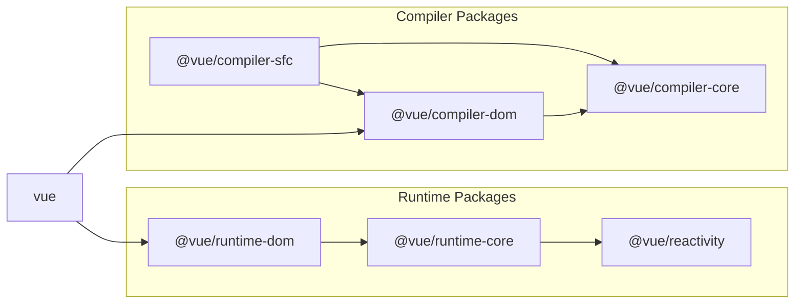

## SFC パーサを実装していく

## 準備

先ほど作ったサンプルのプラグインなのですが，もう不要なので消してしまいましょう．

```sh
pwd # ~
rm -rf ./plugin-sample
```

また Vite の plugin を作成するため Vite 本体をインストールしておきます．

```sh
pwd # ~
ni vite
```

plugin の本体なのですが，本来これは vuejs/core の範囲外なので packages に　`@extensions`　というディレクトリを切ってそこに実装していきます．

```sh
pwd # ~
mkdir -p packages/@extensions/vite-plugin-chibivue
touch packages/@extensions/vite-plugin-chibivue/index.ts
```

`~/packages/@extensions/vite-plugin-chibivue/index.ts`

```ts
import type { Plugin } from 'vite'

export default function vitePluginChibivue(): Plugin {
  return {
    name: 'vite:chibivue',

    transform(code, id) {
      return { code }
    },
  }
}
```

ここから SFC のコンパイラを実装していくのですが，実態がないとイメージが湧きづらいかと思うので playground を実装してみて，動かしながらやっていこうかと思います．  
簡単な SFC とその読み込みを行います．

```sh
pwd # ~
touch examples/playground/src/App.vue
```

`examples/playground/src/App.vue`

```vue
<script>
import { reactive } from 'chibivue'
export default {
  setup() {
    const state = reactive({ message: 'Hello, chibivue!', input: '' })

    const changeMessage = () => {
      state.message += '!'
    }

    const handleInput = e => {
      state.input = e.target?.value ?? ''
    }

    return { state, changeMessage, handleInput }
  },
}
</script>

<template>
  <div class="container" style="text-align: center">
    <h2>{{ state.message }}</h2>
    
    <p><b>chibivue</b> is the minimal Vue.js</p>

    <button @click="changeMessage">click me!</button>

    <br />

    <label>
      Input Data
      <input @input="handleInput" />
    </label>

    <p>input value: {{ state.input }}</p>
  </div>
</template>

<style>
.container {
  height: 100vh;
  padding: 16px;
  background-color: #becdbe;
  color: #2c3e50;
}
</style>
```

`playground/src/main.ts`

```ts
import { createApp } from 'chibivue'
import App from './App.vue'

const app = createApp(App)

app.mount('#app')
```

`playground/vite.config.js`

```ts
import path from 'node:path'
import { fileURLToPath } from 'node:url'
import { defineConfig } from 'vite'

import chibivue from '../../packages/@extensions/vite-plugin-chibivue'

const dirname = path.dirname(fileURLToPath(new URL(import.meta.url)))

export default defineConfig({
  resolve: {
    alias: {
      chibivue: path.resolve(dirname, '../../packages'),
    },
  },
  plugins: [chibivue()],
})
```

この状態で起動してみましょう．


もちろんエラーになります．やったね( ？ )

## エラーの解消

とりあえずエラーを解消していきましょう．いきなり完璧なものは目指しません．  
まず，transform の対象を「\*.vue」に限定してあげましょう．\
sample でやったように id で分岐を書いてもいいのですが，せっかく vite から createFilter という関数が提供されているのでそれでフィルターを作ります．(特に理由はないです．)

`~/packages/@extensions/vite-plugin-chibivue/index.ts`

```ts
import type { Plugin } from 'vite'
import { createFilter } from 'vite'

export default function vitePluginChibivue(): Plugin {
  const filter = createFilter(/\.vue$/)

  return {
    name: 'vite:chibivue',

    transform(code, id) {
      if (!filter(id)) return
      return { code: `export default {}` }
    },
  }
}
```

フィルターを作り，vue ファイルだった場合はファイル内容 `export default {}` に transform してみました．  
おそらくエラーは消え，画面は何も表示されない感じになっているかと思います．

## パーサの実装 on compiler-sfc

さて，これではただのその場しのぎなのでちゃんとした実装をしていきます．  
vite-plugin での役割はあくまで vite を利用する際に vite で transform できるようにするためのものなので，パースやコンパイラは vue の本体にあります．  
それが`compiler-sfc`というディレクトリです．



https://github.com/vuejs/core/blob/main/.github/contributing.md#package-dependencies

SFC のコンパイラは vite だろうが webpack だろうがコアな部分は同じです．それらの実装をになっているのが `compiler-sfc` です．

`compiler-sfc` を作っていきましょう．

```sh
pwd # ~
mkdir packages/compiler-sfc
touch packages/compiler-sfc/index.ts
```

SFC のコンパイルでは `SFCDescriptor` というオブジェクトで SFC を表現します．

```sh
touch packages/compiler-sfc/parse.ts
```

`packages/compiler-sfc/parse.ts`

```ts
import { SourceLocation } from '../compiler-core'

export interface SFCDescriptor {
  id: string
  filename: string
  source: string
  template: SFCTemplateBlock | null
  script: SFCScriptBlock | null
  styles: SFCStyleBlock[]
}

export interface SFCBlock {
  type: string
  content: string
  loc: SourceLocation
}

export interface SFCTemplateBlock extends SFCBlock {
  type: 'template'
}

export interface SFCScriptBlock extends SFCBlock {
  type: 'script'
}

export declare interface SFCStyleBlock extends SFCBlock {
  type: 'style'
}
```

まあ，特に難しいことはないです．SFC の情報をオブジェクトで表現しただけです．

`packages/compiler-sfc/parse.ts` では SFC ファイル(文字列)を `SFCDescriptor` にパースします．  
「ええ．あんだけテンプレートのパースを頑張ったのにまたパーサつくるのかよ．．面倒臭い」と思った方もいるかも知れませんが，安心してください．  
ここで実装するパーサは大したものではないです．というのも，これまで作ってきたものを組み合わせて template，script，style を分離するだけなので楽ちんです．

まず，下準備として以前作った template のパーサを export してあげます．

`~/packages/compiler-dom/index.ts`

```ts
import { baseCompile, baseParse } from '../compiler-core'

export function compile(template: string) {
  return baseCompile(template)
}

// パーサをexportしてあげる
export function parse(template: string) {
  return baseParse(template)
}
```

これらの interface を compiler-sfc 側で持っておいてあげます．

```sh
pwd # ~
touch packages/compiler-sfc/compileTemplate.ts
```

`~/packages/compiler-sfc/compileTemplate.ts`

```ts
import { TemplateChildNode } from '../compiler-core'

export interface TemplateCompiler {
  compile(template: string): string
  parse(template: string): { children: TemplateChildNode[] }
}
```

あとはパーサを実装してあげるだけです．

`packages/compiler-sfc/parse.ts`

```ts
import { ElementNode, NodeTypes, SourceLocation } from '../compiler-core'
import * as CompilerDOM from '../compiler-dom'
import { TemplateCompiler } from './compileTemplate'

/**
 * =========
 * 一部省略
 * =========
 */

export interface SFCParseOptions {
  filename?: string
  sourceRoot?: string
  compiler?: TemplateCompiler
}

export interface SFCParseResult {
  descriptor: SFCDescriptor
}

export const DEFAULT_FILENAME = 'anonymous.vue'

export function parse(
  source: string,
  { filename = DEFAULT_FILENAME, compiler = CompilerDOM }: SFCParseOptions = {},
): SFCParseResult {
  const descriptor: SFCDescriptor = {
    id: undefined!,
    filename,
    source,
    template: null,
    script: null,
    styles: [],
  }

  const ast = compiler.parse(source)
  ast.children.forEach(node => {
    if (node.type !== NodeTypes.ELEMENT) return

    switch (node.tag) {
      case 'template': {
        descriptor.template = createBlock(node, source) as SFCTemplateBlock
        break
      }
      case 'script': {
        const scriptBlock = createBlock(node, source) as SFCScriptBlock
        descriptor.script = scriptBlock
        break
      }
      case 'style': {
        descriptor.styles.push(createBlock(node, source) as SFCStyleBlock)
        break
      }
      default: {
        break
      }
    }
  })

  return { descriptor }
}

function createBlock(node: ElementNode, source: string): SFCBlock {
  const type = node.tag

  let { start, end } = node.loc
  start = node.children[0].loc.start
  end = node.children[node.children.length - 1].loc.end
  const content = source.slice(start.offset, end.offset)

  const loc = { source: content, start, end }
  const block: SFCBlock = { type, content, loc }

  return block
}
```

ここまでパーサを実装してきたみなさんにとっては簡単だと思います．  
実際に SFC を plugin 側でパースしてみましょう．

`~/packages/@extensions/vite-plugin-chibivue/index.ts`

```ts
import { parse } from '../../compiler-sfc'

export default function vitePluginChibivue(): Plugin {
  //.
  //.
  //.
  return {
    //.
    //.
    //.
    transform(code, id) {
      if (!filter(id)) return
      const { descriptor } = parse(code, { filename: id })
      console.log(
        '🚀 ~ file: index.ts:14 ~ transform ~ descriptor:',
        descriptor,
      )
      return { code: `export default {}` }
    },
  }
}
```

このコードは vite が動いているプロセス，つまり node で実行されるので console はターミナルに出力されているかと思います．\


/_ 途中省略 _/


無事にパースできているようです．やったね！

ここまでのソースコード:  
[chibivue (GitHub)](https://github.com/chibivue-land/chibivue/tree/main/book/impls/10_minimum_example/070_sfc_compiler2)
