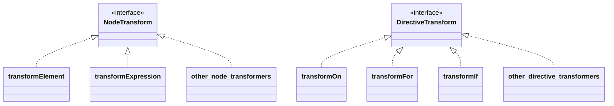

[Prev](https://github.com/Ubugeeei/chibivue/blob/main/books/japanese/340_bcs_options_api.md) | [Next](https://github.com/Ubugeeei/chibivue/blob/main/books/japanese/405_btc_transform_expression.md)

---
title: "Transformer の実装 の Codegen のリファクタ(Basic Template Compiler 部門スタート)"
---

# 既存実装のおさらい

さて、ここからはテンプレートのコンパイラをより本格的に実装していきます。  
Minimum Example 部門でやったところから少し時間が空いてしまったので、今の実装がどうなっていたか少しおさらいをしておきましょう。  
主ななキーワードは Parse, AST, Codegen でした。


```ts
export function baseCompile(
  template: string,
  option: Required<CompilerOptions>
) {
  const ast = baseParse(template.trim());
  const code = generate(ast, option);
  return code;
}
```

実は、この構成は本家のものと少し違っています。  
少し本家のコードを覗いてみましょう。

https://github.com/vuejs/core/blob/37a14a5dae9999bbe684c6de400afc63658ffe90/packages/compiler-core/src/compile.ts#L61

お分かりいただけるでしょうか....

```ts
export function baseCompile(
  template: string,
  option: Required<CompilerOptions>
) {
  const ast = baseParse(template.trim());
  transform(ast);
  const code = generate(ast, option);
  return code;
}
```

のようになっていることが。

今回はこの transform という関数を実装していきます。

# transform とは?

上記のコードでもなんとなく想像がつく通り、パースによって得られた AST を transform によってなんらかしらの形の変換しています。

ここを読んでれば、なんとなく想像がつくかもしれません。  
https://github.com/vuejs/core/blob/37a14a5dae9999bbe684c6de400afc63658ffe90/packages/compiler-core/src/ast.ts#L43C1-L51C23

この、VNODE_CALL と JS から始まる名の付いた AST コードこそが今回扱うものです。
Vue.js のテンプレートコンパイラは、Template を解析した結果としての AST と、生成するコードを表す AST で分かれています。  
今の我々の実装は前者の AST のみを扱っています。

`<p>hello</p>`というテンプレートが入力として与えられたことを考えてみます。

まず、パースによって以下のような AST が生成されます。ここまでは既存実装の通りです。

```ts
interface ElementNode {
  tag: string;
  props: object /** 省略 */;
  children: (ElementNode | TextNode | InterpolationNode)[];
}

interface TextNode {
  content: string;
}
```

```json
{
  "tag": "p",
  "props": {},
  "children": [{ "content": "hello" }]
}
```

「生成するコードを表す AST」というのがどのようなものかというと、まずは生成するコードがどのようなものかについて考えてみてください。
以下のようなものだと思います。

```ts
h("p", {}, ["hello"]);
```

これを表す AST だということです。つまり、生成されるべき JavaScript を表現するための AST で、概ね以下のようなオブジェクトです。

```ts
interface VNodeCall {
  tag: string;
  props: PropsExpression;
  children:
    | TemplateChildNode[] // multiple children
    | TemplateTextChildNode // single text child
    | undefined;
}

type PropsExpression = ObjectExpression | CallExpression | ExpressionNode;
type TemplateChildNode = ElementNode | InterpolationNode | TextNode;
```

```json
{
  "tag": "p",
  "props": {
    "type": "ObjectExpression",
    "properties": []
  },
  "children": { "content": "hello" }
}
```

このように、Codegen で生成されるコードを AST として表現したものが「生成するコードを表す AST」です。
今はこれをわざわざ分けるほどの利点が感じられないかもしれませんが、これからディレクティブを実装したりしていくにあたっては便利なのです。
input にちゃくもした AST と output に着目した AST に分ける感じで、`input の AST -> output の AST` の変換を行う関数こそが `transform` です。

# Codegen Node

流れは掴めたと思うので、改めてどのような Node を扱うのか(どのような Node に変換したいのか)を確認してみます。

最終的には以下の Node を扱います。
https://github.com/vuejs/core/blob/37a14a5dae9999bbe684c6de400afc63658ffe90/packages/compiler-core/src/ast.ts#L43C1-L51C23

この、"JS" から始まる Node + VNODE_CALL が output に着目した AST (以下 CodegenNode と呼びます) です。
しかし、CodegenNode の全てがこれらの Node で構成されているというわけではなく、ElementNode や InterpolationNode などを含んで構成されることになります。

今回扱うもの列挙しつつコメントで説明します。多少省略しているものもあるので、正確にはソースコードを参照してください。

```ts
export interface SimpleExpressionNode extends Node {
  type: NodeTypes.SIMPLE_EXPRESSION;
  content: string;
  isStatic: boolean;
  identifiers?: string[];
}

// h関数をcallしている式を表すNodeです。
// `h("p", { class: 'message'}, ["hello"])` のようなものを想定しています。
export interface VNodeCall extends Node {
  type: NodeTypes.VNODE_CALL;
  tag: string | symbol;
  props: ObjectExpression | undefined; // NOTE: ソースコードでは PropsExpression として実装しています (今後拡張があるので)
  children:
    | TemplateChildNode[] // multiple children
    | TemplateTextChildNode
    | undefined;
}

export type JSChildNode =
  | VNodeCall
  | ObjectExpression
  | ArrayExpression
  | ExpressionNode;

// JavaScript の Object を想定しているNodeです。 VNodeCall の props などが持つことになります。
export interface ObjectExpression extends Node {
  type: NodeTypes.JS_OBJECT_EXPRESSION;
  properties: Array<Property>;
}
export interface Property extends Node {
  type: NodeTypes.JS_PROPERTY;
  key: ExpressionNode;
  value: JSChildNode;
}

// JavaScript の Array を想定しているNodeです。 VNodeCall の children などが持つことになります。
export interface ArrayExpression extends Node {
  type: NodeTypes.JS_ARRAY_EXPRESSION;
  elements: Array<string | Node>;
}
```

# Transformer の設計

transformer の実装をしていく前に設計についてです。
まず、初めに押さえておくべきことは transformer は 2 種類あるということで、NodeTransform と DirectiveTransform というものが存在します。
これらは名前の通り、Node の変換とディレクティブの変換に関するもので、以下のようなインタフェースを取ります。

```ts
export type NodeTransform = (
  node: RootNode | TemplateChildNode,
  context: TransformContext
) => void | (() => void) | (() => void)[];

// TODO:
// export type DirectiveTransform = (
//   dir: DirectiveNode,
//   node: ElementNode,
//   context: TransformContext,
//   augmentor?: (ret: DirectiveTransformResult) => DirectiveTransformResult
// ) => DirectiveTransformResult;
export type DirectiveTransform = Function;
```

DirectiveTransform の方はのちのチャプターのディレクティブを実装していくところで取り上げるのでとりあえず Function というふうにしておきます。  
NodeTransform も DirectiveTransform も実態としては関数です。AST を変換するための関数だと思ってもらえれば問題ないです。  
NodeTransform の結果が関数になっていることに注目してください。transform を実装する際に関数を return するように実装しておくと、その関数はその node の transform 後に実行されるようになっています。(onExit という名前のプロセスです。)  
Node の transform が適応された後に実行したい処理などはここに記述します。これについては後述の traverseNode という関数の説明と一緒に説明を行います。
インタフェースの説明は主には上記の通りです。

そして、より具体的な実装として、Element を変換するための transformElement であったり、式を変換するための transformExpression などがあります。
DirectiveTransform の実装としては各ディレクティブの実装が存在しています。
これらの実装は compiler-core/src/transforms に実装されています。具体的なそれぞれの変換処理はここに実装されます。

https://github.com/vuejs/core/tree/37a14a5dae9999bbe684c6de400afc63658ffe90/packages/compiler-core/src/transforms

イメージ ↓



次に context についてですが、TransformContext にはこれらの transform の際に扱う情報や関数を持ちます。  
今後また追加されていきますが、初めはこれだけで Ok です。

```ts
export interface TransformContext extends Required<TransformOptions> {
  currentNode: RootNode | TemplateChildNode | null;
  parent: ParentNode | null;
  childIndex: number;
}
```

# Transformer の実装

それでは、実際に transform 関数を見ていきます。まずはそれぞれの変換処理の内容に寄らない大枠の説明からです。

構成は非常にシンプルで、context を生成して traverseNode するだけです。
この traverseNode が変換の実装本体です。

```ts
export function transform(root: RootNode, options: TransformOptions) {
  const context = createTransformContext(root, options);
  traverseNode(root, context);
}
```

traverseNode では、基本的には context に保存してある nodeTransforms (Node を変換するための関数を集めたもの)を node に適応するだけです。  
子 Node を持つものに関しては子 Node も traverseNode を通してあげます。  
インタフェースの説明時に登場した onExit もここに実装があります。

```ts
export function traverseNode(
  node: RootNode | TemplateChildNode,
  context: TransformContext
) {
  context.currentNode = node;

  const { nodeTransforms } = context;
  const exitFns = []; // transform後に行いたい処理
  for (let i = 0; i < nodeTransforms.length; i++) {
    const onExit = nodeTransforms[i](node, context);

    // transform後に行いたい処理を登録しておく
    if (onExit) {
      if (isArray(onExit)) {
        exitFns.push(...onExit);
      } else {
        exitFns.push(onExit);
      }
    }
    if (!context.currentNode) {
      return;
    } else {
      node = context.currentNode;
    }
  }

  switch (node.type) {
    case NodeTypes.INTERPOLATION:
      break;
    case NodeTypes.ELEMENT:
    case NodeTypes.ROOT:
      traverseChildren(node, context);
      break;
  }

  context.currentNode = node;

  // transform後に行いたい処理を実行
  let i = exitFns.length;
  while (i--) {
    exitFns[i](); // transformが終わったことを前提にした処理を実行することができる
  }
}

export function traverseChildren(
  parent: ParentNode,
  context: TransformContext
) {
  for (let i = 0; i < parent.children.length; i++) {
    const child = parent.children[i];
    if (isString(child)) continue;
    context.parent = parent;
    context.childIndex = i;
    traverseNode(child, context);
  }
}
```

続いて具体的な変換処理についてですが、今回は例として transformElement を実装してみます。

transformElement では主に NodeTypes.ELEMENT の node を VNodeCall に変換していきます。

```ts
export interface ElementNode extends Node {
  type: NodeTypes.ELEMENT;
  tag: string;
  props: Array<AttributeNode | DirectiveNode>;
  children: TemplateChildNode[];
  isSelfClosing: boolean;
  codegenNode: VNodeCall | SimpleExpressionNode | undefined;
}

// ↓↓↓↓↓↓ 変換 ↓↓↓↓↓↓ //

export interface VNodeCall extends Node {
  type: NodeTypes.VNODE_CALL;
  tag: string | symbol;
  props: PropsExpression | undefined;
  children:
    | TemplateChildNode[] // multiple children
    | TemplateTextChildNode
    | undefined;
}
```

ただのオブジェクト to オブジェクトの変換ですので、それほど難しいものではないと思います。実際にソースコードを読んだりして実装してみましょう。  
一応今回想定するコードは以下に貼っておきます。(ディレクティブの対応は別のチャプターで行います。)

```ts
export const transformElement: NodeTransform = (node, context) => {
  return function postTransformElement() {
    node = context.currentNode!;

    if (node.type !== NodeTypes.ELEMENT) return;

    const { tag, props } = node;

    const vnodeTag = `"${tag}"`;
    let vnodeProps: VNodeCall["props"];
    let vnodeChildren: VNodeCall["children"];

    // props
    if (props.length > 0) {
      const propsBuildResult = buildProps(node);
      vnodeProps = propsBuildResult.props;
    }

    // children
    if (node.children.length > 0) {
      if (node.children.length === 1) {
        const child = node.children[0];
        const type = child.type;
        const hasDynamicTextChild = type === NodeTypes.INTERPOLATION;

        if (hasDynamicTextChild || type === NodeTypes.TEXT) {
          vnodeChildren = child as TemplateTextChildNode;
        } else {
          vnodeChildren = node.children;
        }
      } else {
        vnodeChildren = node.children;
      }
    }

    node.codegenNode = createVNodeCall(vnodeTag, vnodeProps, vnodeChildren);
  };
};

export function buildProps(node: ElementNode): {
  props: PropsExpression | undefined;
  directives: DirectiveNode[];
} {
  const { props } = node;
  let properties: ObjectExpression["properties"] = [];
  const runtimeDirectives: DirectiveNode[] = [];

  for (let i = 0; i < props.length; i++) {
    const prop = props[i];
    if (prop.type === NodeTypes.ATTRIBUTE) {
      const { name, value } = prop;

      properties.push(
        createObjectProperty(
          createSimpleExpression(name, true),
          createSimpleExpression(value ? value.content : "", true)
        )
      );
    } else {
      // directives
      // TODO:
    }
  }

  let propsExpression: PropsExpression | undefined = undefined;
  if (properties.length) {
    propsExpression = createObjectExpression(properties);
  }

  return {
    props: propsExpression,
    directives: runtimeDirectives,
  };
}
```

# Transform した AST をもとに Codegen する

AST を Codegen 用に Transform したわけですから、Codegen の方ももちろん対応する必要があります。
Codegen に入ってくる AST としては主に VNodeClass (とそれらが持つ Node)を想定したコードを書けば OK です。
最終的にどのような文字列として generate したいかは今までと変わりありません。

既存の Codegen は非常に簡素な実装になっているので、ここでもう少し形式的にしておきましょう。(結構ハードコードになっているので)  
Codegen の方でも Codegen 用の context を持つことにして、生成したコードをそこに push していくような構成にしてみようと思います。  
ついでに、context の方に幾つかのヘルパー関数を実装してみます (インデント系とか)

```ts
export interface CodegenContext {
  source: string;
  code: string;
  indentLevel: number;
  line: 1;
  column: 1;
  offset: 0;
  push(code: string, node?: CodegenNode): void;
  indent(): void;
  deindent(withoutNewLine?: boolean): void;
  newline(): void;
}
```

実装内容についてはここでは割愛しますが、それぞれの役割ごとに関数を分けただけで、実装方針の大きな変更はありません。
ディレクティブについてはまだ対応できていないため、その辺りの仮実装を消した兼ね合いで動いていない部分もありますが、
概ね以下のようなコードが動いていれば OK です！

```ts
import { createApp, defineComponent, ref } from "chibivue";

const App = defineComponent({
  setup() {
    const count = ref(0);
    return { count };
  },

  template: `
    <div class="container">
      <p> Hello World! </p>
      <p> Count: {{ count }} </p>
    </div>
  `,
});

const app = createApp(App);

app.mount("#app");
```

ここまでのソースコード:  
https://github.com/Ubugeeei/chibivue/tree/main/books/chapter_codes/400-btc-transformer


[Prev](https://github.com/Ubugeeei/chibivue/blob/main/books/japanese/340_bcs_options_api.md) | [Next](https://github.com/Ubugeeei/chibivue/blob/main/books/japanese/405_btc_transform_expression.md)